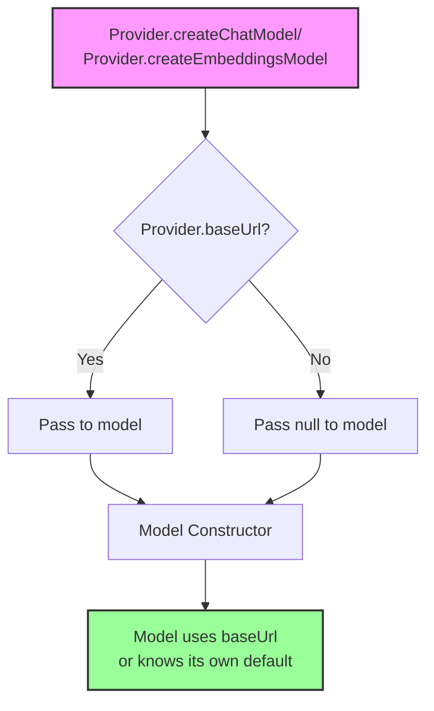

This document specifies how API keys and base URLs are resolved in the
dartantic_ai package, including the precedence hierarchy and
interaction between different configuration methods.

## Overview

The Agent configuration system follows a clear architectural principle: **Agents
are configured with providers, and providers manage their own API keys and base
URLs**. This separation of concerns ensures that:

1. Agents focus on orchestration and tool execution
2. Providers handle authentication and endpoint configuration
3. Models inherit configuration from their providers

Agents can be created with either:
- A provider name string (e.g., `'openai'` or `'openai:gpt-4'`)
- A provider instance (e.g., a custom `OpenAIProvider` with specific
  configuration)

## API Key Resolution Hierarchy

API keys are resolved at the provider level, not the agent level. The resolution
order is:

1. **Provider Instance apiKey Property** - API keys set directly on provider instances take highest precedence
2. **Agent.environment Map** - Environment variables set via `Agent.environment` 
3. **System Environment Variable** - System environment variables accessed via `Platform.environment`

4. **No API Key**
   - Some providers (like Ollama) don't require API keys
   - If a required API key is not found, an exception is thrown

### Resolution Flow

```mermaid
flowchart TD
    A[Agent Creation] --> B{Using provider name?}
    B -->|Yes| C[Look up provider by name<br/>e.g. Agent('openai')]
    B -->|No| D[Use existing provider instance<br/>e.g. Agent.forProvider(provider)]
    
    C --> E[Provider.createChatModel/<br/>Provider.createEmbeddingsModel]
    D --> E
    
    E --> F{Provider has apiKeyName?}
    F -->|Yes| G[Pass: provider.apiKey ?? tryGetEnv(apiKeyName)<br/>may be null]
    F -->|No| H[Pass: provider.apiKey<br/>may be null]
    
    G --> I[Pass: provider.baseUrl ?? defaultBaseUrl<br/>may be null]
    H --> I
    
    I --> J[Model Constructor]
    
    J --> K{apiKey provided?}
    K -->|Yes| L[Use it]
    K -->|No| M[Model calls getEnv with apiKeyName]
    
    M --> N{Agent.environment[apiKeyName]?}
    N -->|Yes| O[Use it]
    N -->|No| P{Platform.environment[apiKeyName]?}
    
    P -->|Yes| Q[Use it]
    P -->|No| R[Throw if required]
    
    style A fill:#f9f,stroke:#333,stroke-width:2px
    style L fill:#9f9,stroke:#333,stroke-width:2px
    style O fill:#9f9,stroke:#333,stroke-width:2px
    style Q fill:#9f9,stroke:#333,stroke-width:2px
    style R fill:#f99,stroke:#333,stroke-width:2px
```

## Base URL Resolution Hierarchy

Base URLs are resolved at the provider level, following the same principle as
API keys:

1. **Provider Constructor Parameter** - Base URLs set directly on provider instances
2. **Provider's Default Base URL** - Each provider defines its own default base URL
3. **Model's Default Base URL** - Each model class defines its own default base URL

### Resolution Flow



## Provider Configuration

Each provider has its own configuration that defines:

### 1. Provider Properties

- **`name`**: The canonical provider name (e.g., 'openai', 'anthropic')
- **`aliases`**: Alternative names for the provider (e.g., 'claude' for
  Anthropic)
- **`displayName`**: Human-readable name for UI display
- **`defaultModelNames`**: Map of default models by ModelKind (chat, embeddings)
- **`baseUrl`**: The API endpoint (nullable - uses model's default if not set)
- **`apiKeyName`**: The environment variable name for the API key (nullable -
  some providers like Ollama don't need API keys)
- **`caps`**: Set of capabilities (chat, embeddings, vision, etc.)

### 2. Provider Examples

#### Providers with API Keys and Base URLs
Providers can be configured with custom API keys and base URLs by creating custom instances with overrides.

#### Providers without API Keys (Local)
Local providers like Ollama don't require API keys and can be configured with custom base URLs for remote servers.

#### Custom Providers (Minimal Configuration)
Custom providers should extend the Provider base class and implement the required factory methods for creating models.

### 3. Provider Resolution Flow

When creating a model through a provider:

```mermaid
flowchart TD
    A[provider.createChatModel/<br/>createEmbeddingsModel] --> B[Provider resolves API key]
    
    B --> C{provider.apiKeyName exists?}
    C -->|Yes| D[apiKey = provider.apiKey ??<br/>tryGetEnv(provider.apiKeyName)]
    C -->|No| E[apiKey = provider.apiKey]
    
    D --> F[Pass to Model Constructor]
    E --> F
    
    F --> G[apiKey: resolved API key<br/>may still be null]
    F --> H[baseUrl: provider.baseUrl<br/>may be null]
    
    G --> I[Model Constructor]
    H --> I
    
    I --> J[Model may do additional resolution]
    J --> K[Uses provided apiKey if not null]
    J --> L[Otherwise calls getEnv(apiKeyName) as fallback]
    
    style A fill:#f9f,stroke:#333,stroke-width:2px
    style I fill:#bbf,stroke:#333,stroke-width:2px
```

Note: The `createChatModel` and `createEmbeddingsModel` methods do not accept `apiKey` or `baseUrl`
parameters. These are set at the provider level through the constructor.

### 4. Provider Discovery

Providers can be discovered by:
- **Name**: `Providers.get('openai')`
- **Alias**: `Providers.get('claude')` → resolves to Anthropic
- **Capabilities**: `Providers.allWith({ProviderCaps.vision})`
- **All Providers**: `Providers.all`

### 5. Provider-Specific Environment Variables

Each provider defines its own environment variable for API keys:

| Provider | apiKeyName | Example |
|----------|------------|---------|
| OpenAI | `OPENAI_API_KEY` | `sk-...` |
| Anthropic | `ANTHROPIC_API_KEY` | `sk-ant-...` |
| Google | `GEMINI_API_KEY` | `...` |
| Mistral | `MISTRAL_API_KEY` | `...` |
| Cohere | `COHERE_API_KEY` | `...` |
| OpenRouter | `OPENROUTER_API_KEY` | `sk-or-...` |
| Together | `TOGETHER_API_KEY` | `...` |
| Lambda | `LAMBDA_API_KEY` | `...` |
| Ollama | `null` | No API key needed |

## Interaction Rules

### 1. Provider Instance Takes Precedence

When using a custom provider instance with an apiKey or baseUrl set, it
overrides all other sources:

```dart
// Provider's apiKey takes precedence over Agent.environment
Agent.environment['OPENAI_API_KEY'] = 'sk-env-key';
final provider = OpenAIProvider(
  apiKey: 'sk-provider-key',
  // ... other params
);
final model = provider.createChatModel(); // Uses 'sk-provider-key'
```

### 2. Agent.environment vs System Environment

`Agent.environment` takes precedence over system environment variables when
looked up via `tryGetEnv`:

```dart
// System env: OPENAI_API_KEY=sk-system-key
Agent.environment['OPENAI_API_KEY'] = 'sk-agent-env-key';
final agent = Agent('openai'); // Uses 'sk-agent-env-key'
```

However, provider instance apiKey takes precedence over both:

```dart
// System env: OPENAI_API_KEY=sk-system-key
Agent.environment['OPENAI_API_KEY'] = 'sk-agent-env-key';
final provider = OpenAIProvider(
  apiKey: 'sk-provider-key',
  // ... other params
);
// Uses 'sk-provider-key', ignoring both environment sources
```

### 3. Provider-Specific Resolution

Each provider may have different apiKeyName values:

```dart
// OpenAI looks for OPENAI_API_KEY
// Anthropic looks for ANTHROPIC_API_KEY
// Mistral looks for MISTRAL_API_KEY
```

### 4. Empty String Handling

Empty strings in provider configuration are treated as "not provided":

```dart
final provider = OpenAIProvider(
  apiKey: '', // Will fall back to environment lookup
  // ... other params
);
```

### 5. Null vs Missing

Null values are treated the same as missing parameters:

```dart
final provider = OpenAIProvider(
  apiKey: null, // Same as not providing apiKey
  // ... other params
);
```

## Cross-Platform Behavior

### Web Platform
- Only `Agent.environment` is available (no system environment)
- Must use `Agent.environment` or direct parameters

### Native Platforms (iOS, Android, Desktop)
- Both `Agent.environment` and system environment available
- System environment accessed via `Platform.environment`

## Error Handling

### Missing Required API Key
```dart
// Throws: Exception('Environment variable OPENAI_API_KEY is not set')
Agent('openai') // When no API key is available
```

### Invalid API Key Format
- No validation at configuration time
- Errors occur during API calls

## Provider Implementation Requirements

### Provider Base Class
Providers must implement both chat and embeddings model creation:


### Model Implementation
Must accept configuration and resolve API key from environment if needed:


## Examples

### Example 1: Using Provider Name with Environment
```dart
Agent.environment['OPENAI_API_KEY'] = 'sk-env-456';
final agent = Agent('openai:gpt-4');
// Uses: apiKey='sk-env-456', baseUrl='https://api.openai.com/v1'
```

### Example 2: Using Custom Provider Instance
```dart
// Create a custom provider with specific configuration
final provider = OpenAIProvider(
  name: 'openai',
  displayName: 'OpenAI',
  defaultModelNames: {
    ModelKind.chat: 'gpt-4o',
    ModelKind.embeddings: 'text-embedding-3-small',
  },
  apiKeyName: 'OPENAI_API_KEY',
  apiKey: 'sk-custom-key',
  baseUrl: Uri.parse('https://proxy.company.com/v1'),
  caps: Providers.openai.caps,
);

final agent = Agent.forProvider(provider);
// Uses: apiKey='sk-custom-key', baseUrl='https://proxy.company.com/v1'
```

### Example 3: Mixed Configuration
```dart
// Provider instance with custom baseUrl, apiKey from environment
Agent.environment['OPENAI_API_KEY'] = 'sk-env-789';

final provider = OpenAIProvider(
  name: 'openai',
  displayName: 'OpenAI',
  defaultModelNames: {
    ModelKind.chat: 'gpt-4o',
    ModelKind.embeddings: 'text-embedding-3-small',
  },
  apiKeyName: 'OPENAI_API_KEY',
  baseUrl: Uri.parse('https://custom.api.com'),
  caps: Providers.openai.caps,
);

final agent = Agent.forProvider(provider);
// Uses: apiKey='sk-env-789' (from environment), baseUrl='https://custom.api.com'
```

### Example 4: Provider-Level Override
```dart
// Create a custom provider instance with overrides
final provider = OpenAIProvider(
  name: 'openai',
  displayName: 'OpenAI',
  defaultModelNames: {
    ModelKind.chat: 'gpt-4o',
    ModelKind.embeddings: 'text-embedding-3-small',
  },
  apiKeyName: 'OPENAI_API_KEY',
  apiKey: 'sk-provider-key',  // Override API key
  baseUrl: Uri.parse('https://provider.api.com'),  // Override base URL
  caps: Providers.openai.caps,
);

final chatModel = provider.createChatModel();
// Uses: apiKey='sk-provider-key', baseUrl='https://provider.api.com'
```

### Example 5: ListModels with Provider Overrides
```dart
// Create provider with custom API key and base URL
final provider = OpenAIProvider(
  name: 'openai',
  displayName: 'OpenAI',
  defaultModelNames: {
    ModelKind.chat: 'gpt-4o',
    ModelKind.embeddings: 'text-embedding-3-small',
  },
  apiKeyName: 'OPENAI_API_KEY',
  apiKey: 'sk-custom-key',
  baseUrl: Uri.parse('https://custom.api.com'),
  caps: Providers.openai.caps,
);

// List models will use the provider's apiKey and baseUrl
await for (final model in provider.listModels()) {
  print('${model.id} supports ${model.kinds}');
}
```


## Testing Requirements

Tests must verify:
1. Each level of the precedence hierarchy
2. Interaction between different configuration methods
3. Cross-platform behavior differences
4. Error cases for missing required configuration
5. Empty string and null handling
6. Provider-specific apiKeyName resolution
7. Agent creation with provider names vs provider instances

## Design Principles

For the architectural separation of concerns between Agent, Provider, and Model layers, see the [Separation of Concerns](unified-provider-architecture.md#separation-of-concerns) section in the Unified Provider Architecture specification.

### Configuration Best Practices

1. **For production use**: Create custom provider instances with explicit
   configuration
2. **For development**: Use environment variables with static provider instances
3. **For testing**: Use Agent.environment to avoid system environment
   dependencies
4. **For multi-tenant**: Create separate provider instances per tenant with
   different API keys
