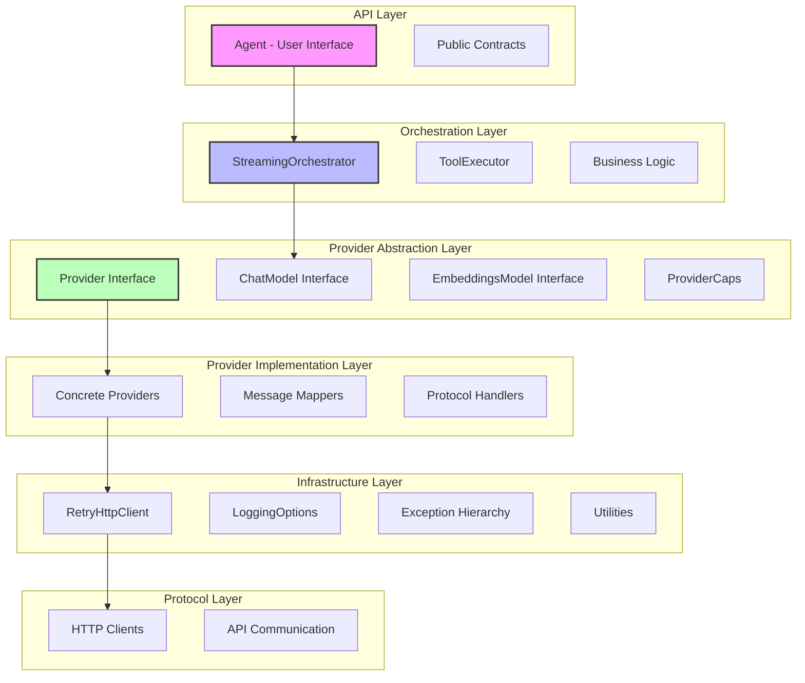
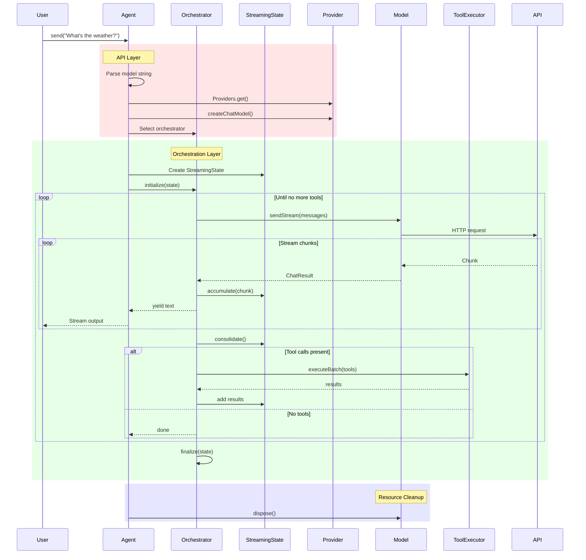
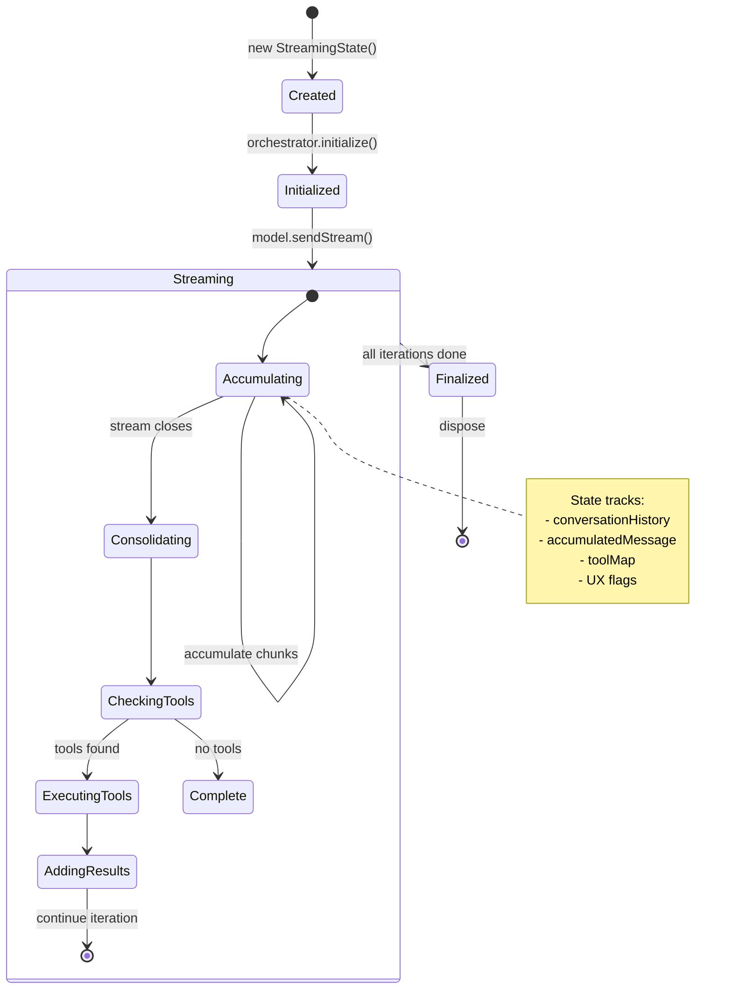
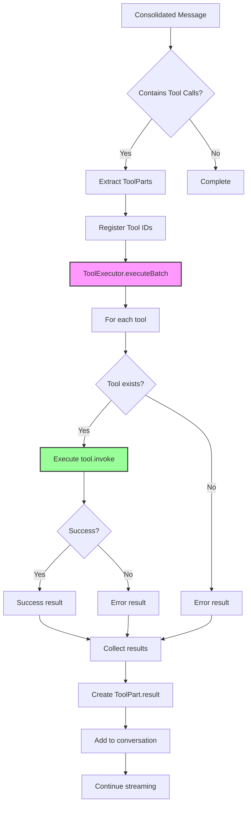
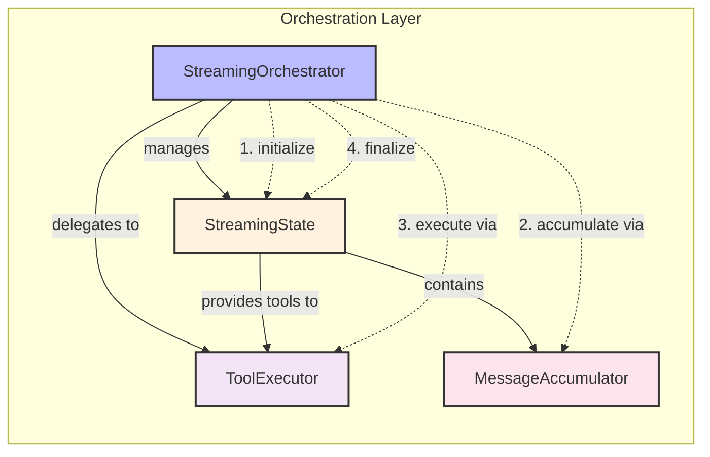

This document provides a comprehensive overview of the dartantic_ai package architecture and points to detailed specifications for each major system.

## System Purpose

The dartantic_ai package provides a unified interface to 15+ LLM providers through a single import, implementing a clean abstraction layer that supports:
- Chat conversations with streaming
- Text embeddings generation
- Tool/function calling 
- Structured JSON output
- Multiple provider types (cloud APIs, local models)
- Comprehensive logging and debugging

## Core Architectural Principles

### 1. **Six-Layer Architecture**
The system is organized into six distinct layers, each with focused responsibilities:



### 2. **Separation of Concerns**
- **Agent (API Layer)**: Thin coordination layer (56% size reduction from monolithic design)
- **Orchestration**: Complex workflow management extracted from Agent
- **Provider Abstraction**: Clean contracts independent of implementation
- **Implementation**: Provider-specific quirks isolated
- **Infrastructure**: Cross-cutting concerns centralized
- **Protocol**: Network communication separated from business logic

### 3. **Streaming-First Design**
- Built on streaming foundation with orchestrator abstraction
- Process entire model stream before making decisions
- Isolated streaming state per request
- Consistent behavior across providers

### 4. **Exception Transparency**
- Never suppress exceptions
- Errors bubble up with full context
- Structured exception hierarchy
- No defensive error hiding

### 5. **Resource Management**
- Direct model creation through providers
- Guaranteed cleanup via try/finally patterns
- Simple disposal with model.dispose()
- No hidden lifecycle management

## Complete Request Flow

The following diagram shows how a chat request with tool calls flows through all layers:



## StreamingState Lifecycle

The StreamingState encapsulates all mutable state during streaming operations:



## Tool Execution Flow

Tool detection, execution, and result integration:



## Orchestration Component Interaction

How orchestration layer components collaborate:



## Major System Components

### 🏗️ **Orchestration Layer**
Coordinates business logic and streaming workflows. See [[Orchestration-Layer-Architecture]] for details.
- DefaultStreamingOrchestrator for standard workflows
- TypedOutputStreamingOrchestrator for structured JSON
- StreamingState for mutable state encapsulation
- ToolExecutor for centralized tool execution

### 🔧 **Unified Provider Architecture**
Single provider interface for both chat and embeddings. See [[Unified-Provider-Architecture]].
- Provider base class with capability declarations
- Factory methods for model creation
- Registry and discovery mechanisms

### 📝 **Model Configuration**
Flexible model string parsing and defaults. See [[Model-Configuration-Spec]].
- URI-based parsing: `provider?chat=model&embeddings=embed`
- Legacy formats supported: `provider:model`
- Provider default models

### 🔑 **Agent Configuration**
API key and base URL resolution. See [[Agent-Config-Spec]].
- Provider-level API key resolution
- Environment variable handling
- Cross-platform considerations

### 🌊 **Streaming & Tool Calls**
Provider-specific streaming patterns. See [[Streaming-Tool-Call-Architecture]].
- Streaming protocol handling per provider
- Tool ID coordination
- Message accumulation strategies

### 📊 **Typed Output**
Structured JSON output across providers. See [[Typed-Output-Architecture]].
- Native schema support where available
- Tool-based fallback pattern
- Schema validation

### 💬 **Message Handling**
Clean message semantics and transformations. See [[Message-Handling-Architecture]].
- Request/response pair semantics
- Tool result consolidation
- Provider-specific mappers

### 📋 **Logging**
Hierarchical, configurable logging. See [[Logging-Architecture]].
- Simple configuration via `Agent.loggingOptions`
- Domain-based organization
- Production-ready patterns

### 🧪 **Testing**
Comprehensive testing strategy. See [[Test-Spec]].
- Capability-based provider filtering
- 80% vs edge case separation
- No regression or performance tests

## Key Implementation Patterns

### Agent Usage
```dart
// Simple usage with defaults
final agent = Agent('openai');
await agent.send('Hello!');

// Specific models
final agent = Agent('openai?chat=gpt-4&embeddings=ada');

// With tools
final agent = Agent('anthropic', tools: [weatherTool]);
await agent.sendStream('What is the weather?');

// Embeddings
final embedding = await agent.embedQuery('search text');
```

### Orchestrator Selection
```dart
// Automatic selection based on request
if (outputSchema != null) {
  return TypedOutputStreamingOrchestrator();
}
return DefaultStreamingOrchestrator();
```

### Provider Discovery
```dart
// Find providers by capability
final toolProviders = Providers.allWith({ProviderCaps.multiToolCalls});
final embeddingsProviders = Providers.allWith({ProviderCaps.embeddings});
```

## Development Guidelines

### Adding New Providers
1. Extend Provider base class
2. Declare capabilities accurately
3. Implement createChatModel() and createEmbeddingsModel()
4. Add to Provider registry
5. Update tests with new provider

### Adding New Features
1. Identify appropriate layer
2. Follow separation of concerns
3. Update relevant specifications
4. Add capability if provider-specific
5. Include tests following 80/20 rule

### Debugging Issues
1. Enable logging: `Agent.loggingOptions = LoggingOptions(level: Level.FINE)`
2. Check provider capabilities
3. Use curl for API ground truth
4. Reference specification documents
5. Let exceptions bubble up

## Related Specifications

- **Provider Setup**: [[OpenAI-Compat]] - API keys and configuration
- **Implementation Guide**: [[Provider-Implementation-Guide]] - Adding new providers
- **State Management**: [[State-Management-Architecture]] - StreamingState details

## Future Considerations

- **Vision/Audio**: Capability system ready for expansion
- **Batch Processing**: Orchestration layer foundation exists
- **Parallel Tool Execution**: Infrastructure supports ParallelToolExecutor
- **Custom Orchestrators**: Pluggable workflow patterns
- **Performance Monitoring**: Hooks available in orchestrators

This architecture provides a robust, maintainable foundation for diverse LLM providers while maintaining a clean, consistent API. The six-layer design with orchestration-based workflows enables complex features without compromising simplicity.
