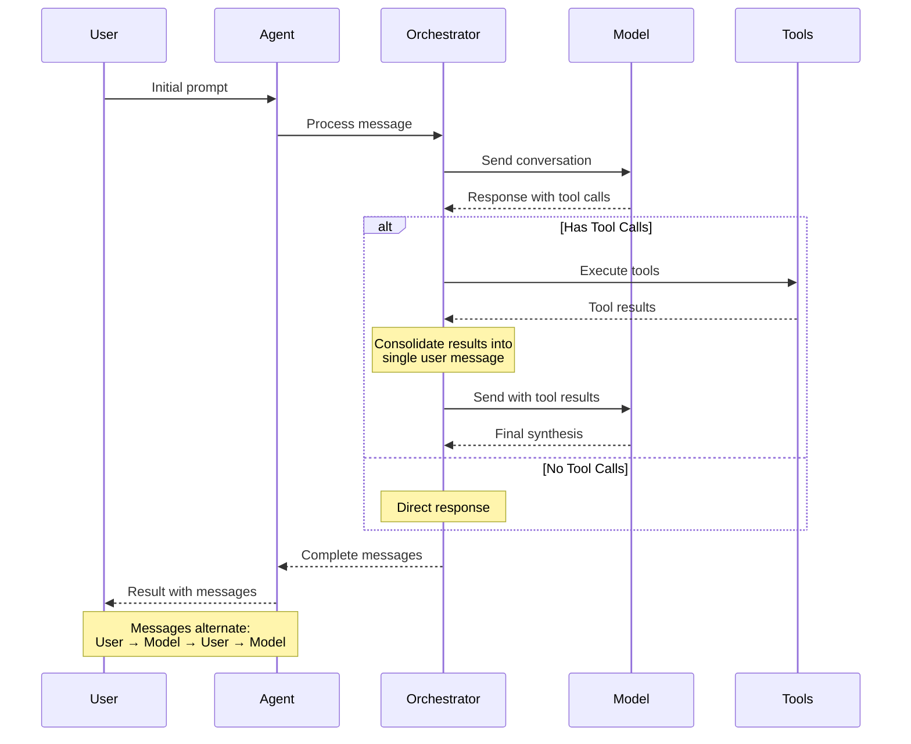
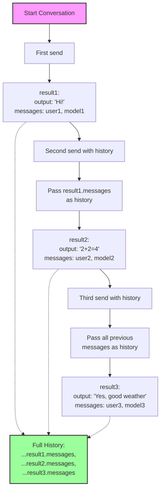
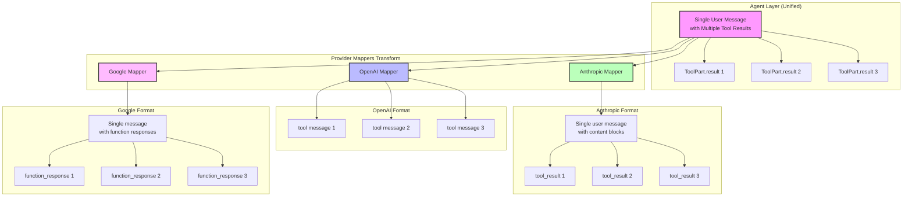

This document specifies how messages are structured and transformed across the Agent and Mapper layers in the dartantic_ai compatibility layer.

## Table of Contents
1. [Core Principles](#core-principles)
2. [Agent Layer Message Semantics](#agent-layer-message-semantics)
3. [Collecting Full History](#collecting-full-history)
4. [Provider-Specific Requirements](#provider-specific-requirements)
5. [Mapper Transformations](#mapper-transformations)
6. [Implementation Examples](#implementation-examples)

## Core Principles

### Clean Separation of Concerns

Message handling operates within the six-layer architecture. For details on each layer's responsibilities, see the [[Home#1-six-layer-architecture]] section in the Architecture Overview.

Key message-handling responsibilities by layer:
- **API Layer**: Maintains clean request/response semantics with alternating user/model messages
- **Orchestration Layer**: Manages message accumulation and tool result consolidation
- **Provider Implementation Layer**: Transforms messages to match provider-specific API requirements

## Agent Layer Message Semantics

The Agent layer maintains a consistent conversation structure:

```
User: Initial prompt
Model: Response with tool calls [toolCall1, toolCall2, toolCall3]
User: Tool results [result1, result2, result3]  // Single message with all results
Model: Final synthesis response
```

### Message Flow Diagram



### Key Rules

1. **Request/Response Pairs**: Messages always alternate between user and model
2. **Tool Result Consolidation**: All tool results from a single round are consolidated into one user message
3. **Multiple Parts**: A single message can contain multiple parts (text, tool calls, tool results)
4. **No Provider Logic**: The Agent doesn't know or care about provider-specific requirements
5. **Complete Message History**: The Agent's `send()` method returns ALL messages from the conversation, including tool interactions, regardless of whether `outputSchema` is provided
6. **Message Processing**: Messages are processed directly by the model layer

## Collecting Full History

The Agent's sendXxx methods return ChatResult objects that contain both the new text and new messages generated during that specific invocation. This design parallels how the methods work:
- Just as sendXxx returns only the NEW text generated by the model (not the entire conversation text)
- sendXxx returns only the NEW messages generated during that send (not the entire conversation history)

### History Accumulation Flow



### Non-Streaming Pattern (send, sendFor)

```dart
// Initial conversation
final result1 = await agent.send('Hello');
// result1.output contains: "Hi! How can I help?"
// result1.messages contains: [user: "Hello", model: "Hi! How can I help?"]

// Continue conversation - pass previous messages as history
final result2 = await agent.send(
  'What is 2+2?', 
  history: result1.messages,
);
// result2.output contains: "2+2 equals 4"
// result2.messages contains: [user: "What is 2+2?", model: "2+2 equals 4"]

// Full conversation history
final fullHistory = [...result1.messages, ...result2.messages];
```

### Streaming Pattern (sendStream)

```dart
// Collect messages during streaming
final messages = <ChatMessage>[];
final textBuffer = StringBuffer();

await for (final chunk in agent.sendStream('Call my tools please')) {
  textBuffer.write(chunk.output);  // Accumulate text chunks
  messages.addAll(chunk.messages); // Accumulate message chunks
}

// After streaming completes:
// textBuffer.toString() contains the full text response
// messages contains all messages from this send (user prompt, tool calls, tool results, final response)
```

### Key Principles

1. **Incremental Results**: Each ChatResult contains only NEW content from that specific send
2. **Manual History Management**: Applications must maintain conversation history by accumulating messages
3. **Consistent Pattern**: Both streaming and non-streaming follow the same incremental pattern
4. **Tool Messages Included**: When tools are called, all intermediate messages (tool calls and results) are included in the returned messages

### Example: Multi-Turn Conversation with Tools

```dart
final agent = Agent('openai:gpt-4o', tools: [weatherTool, timeTool]);
final conversationHistory = <ChatMessage>[];

// Turn 1: Simple question
final result1 = await agent.send('Hello!');
conversationHistory.addAll(result1.messages);
// History now: [user: "Hello!", model: "Hi! How can I help?"]

// Turn 2: Tool calling
final result2 = await agent.send(
  'What is the weather and time in NYC?',
  history: conversationHistory,
);
conversationHistory.addAll(result2.messages);
// result2.messages contains:
// - user: "What is the weather and time in NYC?"
// - model: [tool calls for weather and time]
// - user: [tool results]
// - model: "It's 72°F and 3:45 PM in NYC"

// Turn 3: Follow-up
final result3 = await agent.send(
  'Is that good weather for a walk?',
  history: conversationHistory,
);
conversationHistory.addAll(result3.messages);
// Full conversation maintained with proper context
```

## Typed Output Support

For typed output (structured JSON responses), see [[Typed-Output-Architecture]]. The key points for message handling:

- When `outputSchema` is provided, Agent adds a `return_result` tool
- Tool results are still consolidated into single user messages as normal
- The final JSON output replaces the text output in ChatResult

## Streaming Enhancements

### Tool Call Argument Parsing

Tool arguments are always provided as parsed Map<String, dynamic> in ToolPart:

```dart
// Simple argument extraction - ToolPart always has parsed arguments
final args = toolPart.arguments ?? {};
// Arguments are already parsed by the provider mappers
```

### UX Enhancement: Message Separation

When streaming responses that involve tool calls, the Agent adds a newline prefix to prevent consecutive AI messages from running together:

```dart
// Prevents: "...calling tools.The weather is..."
// Becomes: "...calling tools.\nThe weather is..."
```

This only applies to the FIRST chunk of a new AI message after tool execution, maintaining proper text flow within each message.

## Provider-Specific Requirements

Different providers have different API requirements:

### Provider Message Format Comparison



### OpenAI
- **Requirement**: Each tool result must be a separate message
- **Format**: Multiple consecutive user messages, each with role="tool"
- **Example**:
  ```
  {"role": "assistant", "tool_calls": [{"id": "1", ...}, {"id": "2", ...}]}
  {"role": "tool", "tool_call_id": "1", "content": "result1"}
  {"role": "tool", "tool_call_id": "2", "content": "result2"}
  ```

### Anthropic
- **Requirement**: Tool results can be in a single user message
- **Format**: One user message with multiple tool_result blocks
- **Example**:
  ```
  {"role": "assistant", "content": [{"type": "tool_use", "id": "1"}, {"type": "tool_use", "id": "2"}]}
  {"role": "user", "content": [{"type": "tool_result", "tool_use_id": "1"}, {"type": "tool_result", "tool_use_id": "2"}]}
  ```

### Google/Gemini
- **Requirement**: Function responses in a single message
- **Format**: One message with multiple function response parts

### Ollama
- **Requirement**: Varies by endpoint (native vs OpenAI-compatible)
- **Format**: Adapts based on endpoint type

## Mapper Transformations

Each mapper transforms the Agent's message structure to match provider requirements:

### OpenAI Mapper

```dart
// Agent sends: One user message with multiple tool results
ChatMessage(
  role: ChatMessageRole.user,
  parts: [
    ToolPart.result(id: "1", name: "tool1", result: "..."),
    ToolPart.result(id: "2", name: "tool2", result: "..."),
  ]
)

// Mapper transforms to: Multiple tool messages
[
  ChatCompletionMessage.tool(toolCallId: "1", content: "..."),
  ChatCompletionMessage.tool(toolCallId: "2", content: "..."),
]
```

### Anthropic Mapper

```dart
// Agent sends: One user message with multiple tool results
ChatMessage(
  role: ChatMessageRole.user,
  parts: [
    ToolPart.result(id: "1", name: "tool1", result: "..."),
    ToolPart.result(id: "2", name: "tool2", result: "..."),
  ]
)

// Mapper transforms to: Single user message with multiple content blocks
Message(
  role: ChatMessageRole.user,
  content: [
    ContentBlock.toolResult(toolUseId: "1", content: "..."),
    ContentBlock.toolResult(toolUseId: "2", content: "..."),
  ]
)
```

## Implementation Examples

### API Layer (Agent) - Orchestrator Delegation

The Agent now supports both chat and embeddings operations:

```dart
// Agent delegates to orchestrator for complex chat workflows
final orchestrator = _selectOrchestrator(outputSchema: outputSchema, tools: model.tools);
final state = StreamingState(
  conversationHistory: conversationHistory,
  toolMap: {for (final tool in model.tools ?? <Tool>[]) tool.name: tool},
);

orchestrator.initialize(state);

try {
  await for (final result in orchestrator.processIteration(model, state)) {
    // Yield streaming results from orchestrator
    yield ChatResult<String>(
      id: result.id,
      output: result.output,
      messages: result.messages,
      finishReason: result.finishReason,
      metadata: result.metadata,
      usage: result.usage,
    );
  }
} finally {
  orchestrator.finalize(state);
}

// Agent also supports embeddings operations
final embedding = await agent.embedQuery('search text');
final embeddings = await agent.embedDocuments(['doc1', 'doc2']);
```

### Orchestration Layer - Tool Execution

```dart
// In StreamingOrchestrator.processIteration()
final toolCalls = consolidatedMessage.parts
    .whereType<ToolPart>()
    .where((p) => p.kind == ToolPartKind.call)
    .toList();

if (toolCalls.isNotEmpty) {
  // Delegate to ToolExecutor
  final results = await state.executor.executeBatch(toolCalls, state.toolMap);
  
  // Convert to ToolPart.result
  final toolResultParts = results.map((result) => ToolPart.result(
    id: result.toolCall.id,
    name: result.toolCall.name,
    result: result.isSuccess ? result.result : json.encode({'error': result.error}),
  )).toList();

  // Create single user message with all tool results
  final toolResultMessage = ChatMessage(
    role: ChatMessageRole.user,
    parts: toolResultParts,
  );

  // Add to conversation state and yield
  state.conversationHistory.add(toolResultMessage);
  yield StreamingIterationResult(
    output: '',
    messages: [toolResultMessage],
    shouldContinue: true,
  );
}
```

### OpenAI Mapper (Provider-Specific)

```dart
// In _mapMessages, when processing user messages with tool results:
if (toolResults.length > 1) {
  // OpenAI requires separate tool messages for each result
  for (final toolResult in toolResults) {
    final content = ToolResultHelpers.serialize(toolResult.result);
    expandedMessages.add(
      ChatCompletionMessage.tool(
        toolCallId: toolResult.id,
        content: content,
      ),
    );
  }
} else if (toolResults.length == 1) {
  // Single tool result
  expandedMessages.add(
    ChatCompletionMessage.tool(
      toolCallId: toolResults.first.id,
      content: ToolResultHelpers.serialize(toolResults.first.result),
    ),
  );
}
```

## Key Design Benefits

1. **Clean Architecture**: Agent maintains simple, consistent message structure while delegating complexity
2. **Orchestration Power**: Complex workflows handled by specialized orchestrators
3. **State Encapsulation**: Mutable state isolated in StreamingState for better reliability
4. **Clean Abstractions**: MessageAccumulator and ToolExecutor provide consistent interfaces
5. **Provider Flexibility**: Each mapper handles its provider's specific requirements
6. **Easy Testing**: Each layer can be tested in isolation with clear boundaries
7. **Future Proof**: New orchestrators and providers can be added without changing core logic
8. **Resource Management**: Guaranteed cleanup through try/finally patterns
9. **Clear Semantics**: Request/response pairs maintained with orchestrated execution

## Orchestration Layer Benefits

### Message Flow Control

1. **Streaming Coordination**: Orchestrators manage complex streaming workflows
2. **State Transitions**: Clean state management through StreamingState
3. **Tool Orchestration**: Centralized tool execution with error handling
4. **UX Enhancement**: Consistent streaming experience across providers

### Component Interactions

```dart
// Clear data flow through orchestration layer
Agent → StreamingOrchestrator → ChatModel → Provider API
  ↓           ↓                    ↓
StreamingState → ToolExecutor → MessageAccumulator
```


