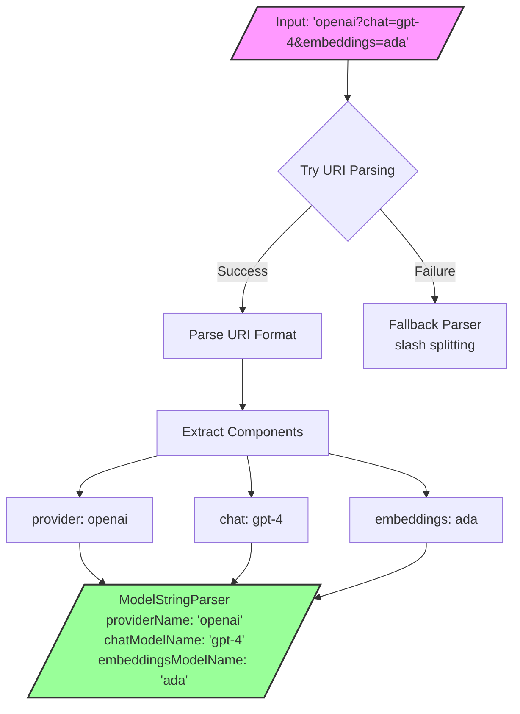
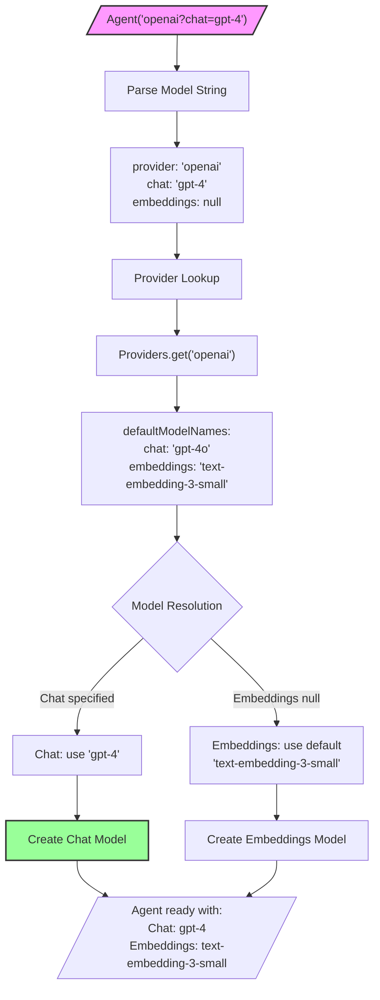

This document defines the model configuration system for dartantic 1.0, including model string formats, naming conventions, and provider defaults.

## Model String Format

The `ModelStringParser` supports flexible URI-based parsing with multiple formats for backward compatibility:

### Supported Formats

| Format | Example | Parsed Result |
|--------|---------|---------------|
| **Provider only** | `openai` | provider: `openai`, chat: `null`, embeddings: `null` |
| **Provider:model** | `openai:gpt-4o` | provider: `openai`, chat: `gpt-4o`, embeddings: `null` |
| **Provider/model** | `openai/gpt-4o` | provider: `openai`, chat: `gpt-4o`, embeddings: `null` |
| **Query params** | `openai?chat=gpt-4o&embeddings=text-embedding-3` | provider: `openai`, chat: `gpt-4o`, embeddings: `text-embedding-3` |

### Parsing Flow



### Implementation

```dart
factory ModelStringParser.parse(String model) {
  final uri = Uri.tryParse(model);
  if (uri != null) {
    // Handles all formats elegantly using Uri parsing
    // - Absolute URIs: provider:model (colon becomes scheme separator)
    // - Relative URIs: provider, provider/model, or provider?params
  }
  // Fallback for edge cases
}
```

### String Building

The parser can also build model strings using `toString()`:
- Provider only → `"openai"`
- Chat model only → `"openai:gpt-4"` (uses colon format)
- Multiple models → `"openai?chat=gpt-4&embeddings=ada"` (uses query format)

## Provider Model Defaults

Each provider defines default models for both chat and embeddings operations:

### Default Resolution Flow



### Provider Defaults Table

| Provider | Chat Default | Embeddings Default |
|----------|--------------|-------------------|
| OpenAI | `gpt-4o` | `text-embedding-3-small` |
| Anthropic | `claude-3-5-sonnet-20241022` | N/A (no embeddings) |
| Google | `gemini-2.0-flash` | `models/text-embedding-004` |
| Mistral | `mistral-7b-instruct` | `mistral-embed` |
| Cohere | `command-r-plus` | `embed-v4.0` |
| Ollama | `llama3.2` | N/A (no embeddings) |
| OpenRouter | `google/gemini-2.0-flash` | N/A (chat only) |
| Together | `meta-llama/Llama-3.2-3B-Instruct-Turbo` | N/A (chat only) |
| Lambda | `hermes-3-llama-3.1-405b-fp8` | N/A (chat only) |

### Provider Configuration

```dart
abstract class Provider {
  final Map<ModelKind, String> defaultModelNames;
  
  // Example provider with both chat and embeddings
  static final openai = OpenAIProvider(
    name: 'openai',
    displayName: 'OpenAI',
    defaultModelNames: {
      ModelKind.chat: 'gpt-4o',
      ModelKind.embeddings: 'text-embedding-3-small',
    },
    apiKeyName: 'OPENAI_API_KEY',
    caps: {ProviderCaps.chat, ProviderCaps.embeddings, ...},
  );
}
```

## Model Naming Convention

All models use consistent parameter naming across the codebase:

```dart
// Chat models
ChatModel({
  required this.name,  // Always 'name', not 'model' or 'modelId'
  required this.defaultOptions,
  this.tools,
  this.temperature,
  
});

// Embeddings models
EmbeddingsModel({
  required this.name,  // Same convention
  required this.defaultOptions,
  this.dimensions,
  this.batchSize,
});
```

This consistency ensures:
- Easy refactoring and searching
- Clear API surface
- No confusion between `model`, `modelId`, `modelName`, etc.

## Usage Examples

### Simple Provider (Uses All Defaults)
```dart
// Uses provider defaults for both chat and embeddings
final agent = Agent('openai');
// Chat: gpt-4o, Embeddings: text-embedding-3-small
```

### Specific Chat Model
```dart
// Overrides chat model, uses default embeddings
final agent = Agent('openai:gpt-4o');
// or
final agent = Agent('openai/gpt-4o');
// Chat: gpt-4o, Embeddings: text-embedding-3-small
```

### Different Models for Each Operation
```dart
// Explicit models for both operations
final agent = Agent('openai?chat=gpt-4o&embeddings=text-embedding-3-large');
// Chat: gpt-4o, Embeddings: text-embedding-3-large
```

### Direct Provider Usage
```dart
final provider = Providers.openai;
final chatModel = provider.createChatModel(name: 'gpt-4o');
final embeddingsModel = provider.createEmbeddingsModel();  // Uses default
```

### Custom Provider Instance
```dart
final provider = OpenAIProvider(
  apiKey: 'sk-custom',
  baseUrl: Uri.parse('https://proxy.com/v1'),
  defaultModelNames: {
    ModelKind.chat: 'gpt-4o',
    ModelKind.embeddings: 'text-embedding-3-large',
  },
);
final agent = Agent.forProvider(provider);
```

## Provider Resolution

1. **Provider name lookup** (case-insensitive)
   - `Agent('OpenAI')` → finds `openai` provider
   
2. **Alias resolution**
   - `Agent('claude')` → resolves to `anthropic` provider
   
3. **Model defaults** from `provider.defaultModelNames[ModelKind]`
   - Used when no explicit model specified
   
4. **Explicit model names** override defaults
   - `Agent('openai:gpt-4')` overrides chat default

## Edge Cases and Validation

### Valid Examples
- `openai` - Provider only, uses all defaults
- `openai:gpt-4` - Explicit chat model
- `openai/gpt-4` - Alternative syntax for chat model
- `openai?chat=gpt-4&embeddings=ada` - Explicit both models
- `google?embeddings=models/text-embedding-004` - Embeddings only

### Invalid Examples
- Empty string → throws `Exception('Invalid model string format: ""')`
- Invalid format → throws parsing exception

### Resolution Examples
- Providers without embeddings support throw `UnsupportedError` when embeddings methods are called
- Custom models override defaults only for specified types
- `Agent.forProvider` allows direct provider instance usage with optional model overrides

## Design Principles

1. **Simplicity**: URI parsing handles all formats cleanly
2. **Consistency**: All models use `name` parameter
3. **Flexibility**: Support both simple and complex configurations
4. **Type Safety**: Separate chat and embeddings model creation
5. **Backwards Compatibility**: Legacy `provider:model` format still works
6. **Extensibility**: Query format allows future model types

## Related Specifications

- **API Key Resolution**: See [[Agent-Config-Spec]]
- **Provider Architecture**: See [[Unified-Provider-Architecture]]
