This document lists popular OpenAI-compatible LLM providers, their base URLs, API key names (for use in environment variables or config), and where to obtain API keys.

## Provider Architecture

```mermaid
flowchart TB
    subgraph "OpenAI-Compatible Providers"
        OAI[OpenAI<br/>gpt-4o]
        OR[OpenRouter<br/>google/gemini-2.0-flash]
        TOG[Together AI<br/>meta-llama/Llama-3.2-3B]
        LAM[Lambda<br/>hermes-3-llama-3.1-405b-fp8]
        GOA[Google AI OpenAI<br/>gemini-2.0-flash]
        OLL[Ollama OpenAI<br/>llama3.2]
    end
    
    subgraph "Native API Providers"
        GOO[Google<br/>gemini-2.0-flash]
        ANT[Anthropic<br/>claude-3-5-sonnet]
        MIS[Mistral<br/>mistral-7b-instruct]
        COH[Cohere<br/>command-r-plus]
        OLN[Ollama Native<br/>qwen2.5:7b-instruct]
    end
    
    OAI --> OAPIC[OpenAIProvider Class]
    OR --> OAPIC
    TOG --> OAPIC
    LAM --> OAPIC
    GOA --> OAPIC
    OLL --> OAPIC
    
    GOO --> GOOP[GoogleProvider Class]
    ANT --> ANTP[AnthropicProvider Class]
    MIS --> MISP[MistralProvider Class]
    COH --> COHP[CohereProvider Class]
    OLN --> OLNP[OllamaProvider Class]
    
    OAPIC --> API1["/v1/chat/completions"]
    GOOP --> API2["/v1beta/models/.../generateContent"]
    ANTP --> API3["/v1/messages"]
    MISP --> API4["/v1/chat/completions"]
    COHP --> API5["/v1/chat"]
    OLNP --> API6["/api/chat"]
    
    style OAI fill:#f9f,stroke:#333,stroke-width:2px
    style OR fill:#f9f,stroke:#333,stroke-width:2px
    style TOG fill:#f9f,stroke:#333,stroke-width:2px
    style LAM fill:#f9f,stroke:#333,stroke-width:2px
    style GOA fill:#f9f,stroke:#333,stroke-width:2px
    style OLL fill:#f9f,stroke:#333,stroke-width:2px
    
    style GOO fill:#9ff,stroke:#333,stroke-width:2px
    style ANT fill:#9ff,stroke:#333,stroke-width:2px
    style MIS fill:#9ff,stroke:#333,stroke-width:2px
    style COH fill:#9ff,stroke:#333,stroke-width:2px
    style OLN fill:#9ff,stroke:#333,stroke-width:2px
```

## OpenAI-Compatible Providers

| Provider                   | Base URL                                                  | API Key Name         | Default Model                                       | Get API Key                                                           | Notes |
| -------------------------- | --------------------------------------------------------- | -------------------- | --------------------------------------------------- | --------------------------------------------------------------------- | ----- |
| **OpenAI**                 | `https://api.openai.com/v1`                               | `OPENAI_API_KEY`     | `gpt-4o`                                            | [OpenAI API Keys](https://platform.openai.com/api-keys)               |       |
| **OpenRouter**             | `https://openrouter.ai/api/v1`                            | `OPENROUTER_API_KEY` | `google/gemini-2.0-flash`                           | [OpenRouter API Keys](https://openrouter.ai/keys)                     |       |
| **Together AI**            | `https://api.together.xyz/v1`                             | `TOGETHER_API_KEY`   | `meta-llama/Llama-3.2-3B-Instruct-Turbo`           | [Together API Keys](https://api.together.ai/)                         | Tool support disabled due to non-standard streaming format |
| **Lambda**                 | `https://api.lambda.ai/v1`                                | `LAMBDA_API_KEY`     | `hermes-3-llama-3.1-405b-fp8`                      | [Lambda API Keys](https://cloud.lambda.ai/api-keys/cloud-api)         |       |
| **Google AI (OpenAI)**     | `https://generativelanguage.googleapis.com/v1beta/openai` | `GEMINI_API_KEY`     | `gemini-2.0-flash`                                  | [Google AI Studio API Keys](https://makersuite.google.com/app/apikey) | OpenAI-compatible Gemini endpoint |
| **Ollama (OpenAI-compat)** | `http://localhost:11434/v1`                               | (none)               | `llama3.2`                                          | [Ollama Docs](https://github.com/ollama/ollama/blob/main/docs/api.md) | Local OpenAI-compatible endpoint |

## Native API Providers (Not OpenAI-Compatible)

These providers use their own native APIs in dartantic and are not OpenAI-compatible:

| Provider       | API Key Name         | Default Model                   | Notes |
| -------------- | -------------------- | ------------------------------- | ----- |
| **Google**     | `GEMINI_API_KEY`     | `gemini-2.0-flash`              | Native Gemini API |
| **Anthropic**  | `ANTHROPIC_API_KEY`  | `claude-3-5-sonnet-20241022`    | Native Claude API |
| **Mistral**    | `MISTRAL_API_KEY`    | `mistral-7b-instruct`           | Native Mistral API |
| **Cohere**     | `COHERE_API_KEY`     | `command-r-plus`                | Native Cohere API with some OpenAI compatibility |
| **Ollama**     | (none)               | `qwen2.5:7b-instruct`           | Native Ollama API at `/api` endpoint |

**Notes:**
- All OpenAI-compatible providers use the `/chat/completions` endpoint and the `Authorization: Bearer <API_KEY>` header.
- Some providers may require you to specify a model name in your request payload.
- For Google AI OpenAI-compatible endpoint, use your Google AI Studio API key (GEMINI_API_KEY) and the special base URL as shown above. See the [official Gemini OpenAI compatibility docs](https://ai.google.dev/gemini-api/docs/openai) for details.
- Together AI has tool support disabled due to its non-standard streaming format that uses `<|python_tag|>` prefix instead of standard OpenAI tool_calls format.
- For a more comprehensive and up-to-date list of OpenAI-compatible providers, see [cheahjs/free-llm-api-resources](https://github.com/cheahjs/free-llm-api-resources).
