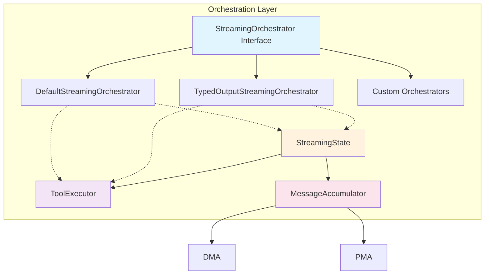
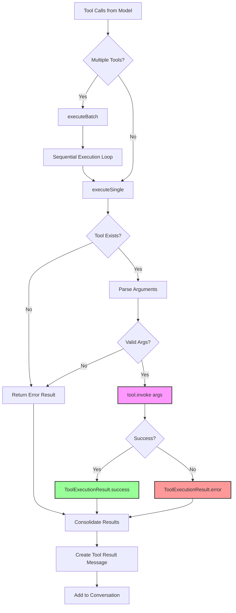
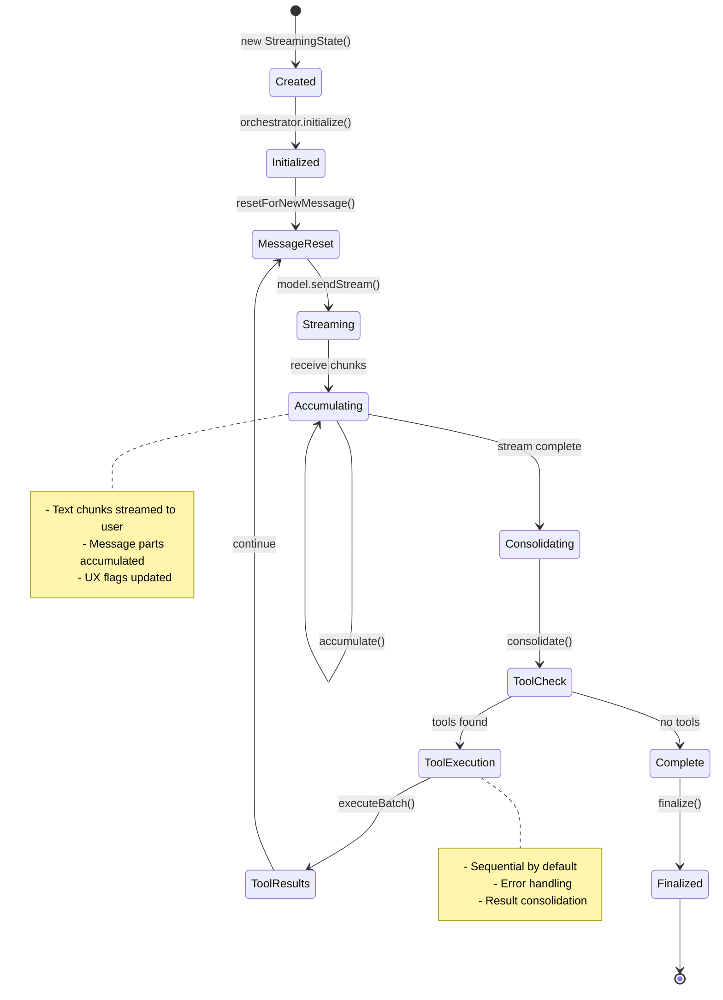

This document specifies the orchestration layer in the dartantic_ai compatibility layer, which coordinates complex streaming workflows, tool execution, and business logic across providers.

## Table of Contents
1. [Overview](#overview)
2. [Core Components](#core-components)
3. [StreamingOrchestrator Interface](#streamingorchestrator-interface)
4. [Built-in Orchestrators](#built-in-orchestrators)
5. [ToolExecutor System](#toolexecutor-system)
6. [StreamingState Management](#streamingstate-management)
7. [MessageAccumulator Strategy](#messageaccumulator-strategy)
8. [Orchestrator Selection](#orchestrator-selection)
9. [Error Handling](#error-handling)
10. [Performance Considerations](#performance-considerations)
11. [Extension Patterns](#extension-patterns)
12. [Testing Strategies](#testing-strategies)

## Overview

The orchestration layer sits between the Agent API layer and the provider implementation layer, providing sophisticated workflow coordination while maintaining clean separation of concerns. This layer enables:

- **Complex Workflow Management**: Multi-step processes with tool calls and streaming
- **Provider Abstraction**: Same orchestrators work across all providers
- **State Isolation**: Encapsulated mutable state per request
- **Provider Abstraction**: MessageAccumulator handles provider-specific streaming patterns
- **Resource Management**: Guaranteed cleanup and lifecycle management

### Architectural Position

```
Agent (API Layer)
    ↓
StreamingOrchestrator (Orchestration Layer) ← YOU ARE HERE
    ↓
ChatModel (Provider Abstraction Layer)
    ↓
Provider Implementation (OpenAI, Anthropic, etc.)
```

## Core Components

### Component Overview



### Responsibilities

1. **StreamingOrchestrator**: Coordinates entire streaming workflow
2. **ToolExecutor**: Manages tool execution with error handling
3. **StreamingState**: Encapsulates all mutable state during operations
4. **MessageAccumulator**: Handles provider-specific streaming patterns

## StreamingOrchestrator Interface

### Interface Definition

```dart
/// Coordinates streaming workflows and tool execution across providers
abstract interface class StreamingOrchestrator {
  /// Provider hint for orchestrator identification and selection
  String get providerHint;
  
  /// Initialize the orchestrator with streaming state
  /// Called once before streaming begins
  void initialize(StreamingState state);
  
  /// Process a single iteration of the streaming workflow
  /// Yields streaming results as they become available
  /// Returns when this iteration is complete (may continue for more iterations)
  Stream<StreamingIterationResult> processIteration(
    ChatModel<ChatModelOptions> model,
    StreamingState state, {
    JsonSchema? outputSchema,
  });
  
  /// Finalize the orchestrator after streaming completes
  /// Called once after all streaming iterations are complete
  void finalize(StreamingState state);
}
```

### StreamingIterationResult

```dart
/// Result from a single iteration of streaming orchestration
class StreamingIterationResult {
  /// Text output to stream to user (empty for non-text results)
  final String output;
  
  /// Messages to add to conversation history
  final List<ChatMessage> messages;
  
  /// Whether streaming should continue with another iteration
  final bool shouldContinue;
  
  /// Finish reason for this iteration
  final FinishReason finishReason;
  
  /// Metadata for this iteration
  final Map<String, dynamic> metadata;
  
  /// Usage statistics for this iteration
  final LanguageModelUsage usage;
  
  /// Unique identifier for this iteration
  final String id;
}
```

### Orchestrator Lifecycle

```mermaid
sequenceDiagram
    participant Agent
    participant Orchestrator
    participant State as StreamingState
    participant Model as ChatModel
    participant Executor as ToolExecutor
    
    Agent->>+Orchestrator: selectOrchestrator(outputSchema)
    Agent->>+State: create StreamingState
    Agent->>Orchestrator: initialize(state)
    
    loop Until Done
        Agent->>+Orchestrator: processIteration(model, state)
        Orchestrator->>+Model: sendStream(conversationHistory)
        
        loop Stream Chunks
            Model-->>Orchestrator: chunk
            Orchestrator->>State: accumulate(chunk)
            Orchestrator-->>Agent: yield StreamingResult(text)
        end
        
        Model-->>-Orchestrator: stream complete
        Orchestrator->>State: consolidate message
        
        alt Tool Calls Found
            Orchestrator->>+Executor: executeBatch(toolCalls)
            Executor-->>-Orchestrator: tool results
            Orchestrator->>State: add tool results
            Orchestrator-->>Agent: yield StreamingResult(continue=true)
        else No Tool Calls
            Orchestrator-->>-Agent: yield StreamingResult(continue=false)
            State->>State: markDone()
        end
    end
    
    Agent->>Orchestrator: finalize(state)
    Agent->>-State: dispose
```

### Code Implementation

```dart
// Complete orchestrator lifecycle in Agent
final orchestrator = _selectOrchestrator(outputSchema: outputSchema);
final state = StreamingState(
  conversationHistory: conversationHistory,
  toolMap: toolMap,
);

// 1. Initialize
orchestrator.initialize(state);

try {
  // 2. Process iterations until complete
  while (!state.done) {
    await for (final result in orchestrator.processIteration(model, state)) {
      yield result;
      
      // Check if we should continue
      if (!result.shouldContinue) {
        state.done = true;
        break;
      }
    }
  }
} finally {
  // 3. Finalize
  orchestrator.finalize(state);
}
```

## Built-in Orchestrators

### DefaultStreamingOrchestrator

Handles standard chat and tool calling workflows:

```dart
class DefaultStreamingOrchestrator implements StreamingOrchestrator {
  const DefaultStreamingOrchestrator();
  
  @override
  String get providerHint => 'default';
  
  @override
  void initialize(StreamingState state) {
    _logger.fine('Initializing default streaming orchestrator');
    state.resetForNewMessage();
  }
  
  @override
  Stream<StreamingIterationResult> processIteration(
    ChatModel<ChatModelOptions> model,
    StreamingState state, {
    JsonSchema? outputSchema,
  }) async* {
    // 1. Reset state for new message
    state.resetForNewMessage();
    
    // 2. Stream model response and accumulate
    await for (final result in model.sendStream(state.conversationHistory)) {
      // Stream text chunks immediately for UX
      final textOutput = result.output.parts
          .whereType<TextPart>()
          .map((p) => p.text)
          .join();
      
      if (textOutput.isNotEmpty) {
        final streamOutput = _shouldPrefixNewline(state)
            ? '\n$textOutput'
            : textOutput;
        
        state.markMessageStarted();
        
        yield StreamingIterationResult(
          output: streamOutput,
          messages: const [],
          shouldContinue: true,
          finishReason: result.finishReason,
          metadata: result.metadata,
          usage: result.usage,
          id: result.id,
        );
      }
      
      // Accumulate the complete message
      state.accumulatedMessage = state.accumulator.accumulate(
        state.accumulatedMessage,
        result.output,
      );
      state.lastResult = result;
    }
    
    // 3. Consolidate accumulated message
    final consolidatedMessage = state.accumulator.consolidate(
      state.accumulatedMessage,
    );
    
    _logger.fine(
      'Stream closed. Consolidated message has '
      '${consolidatedMessage.parts.length} parts',
    );
    
    // 4. Add complete message to conversation
    state.conversationHistory.add(consolidatedMessage);
    
    yield StreamingIterationResult(
      output: '',
      messages: [consolidatedMessage],
      shouldContinue: true,
      finishReason: state.lastResult.finishReason,
      metadata: state.lastResult.metadata,
      usage: state.lastResult.usage,
      id: state.lastResult.id,
    );
    
    // 5. Execute tools if present
    final toolCalls = consolidatedMessage.parts
        .whereType<ToolPart>()
        .where((p) => p.kind == ToolPartKind.call)
        .toList();
    
    if (toolCalls.isNotEmpty) {
      _logger.info(
        'Found ${toolCalls.length} tool calls to execute: '
        '${toolCalls.map((t) => '${t.name}(${t.id})').join(', ')}',
      );
      
      // Execute tools
      final results = await state.executor.executeBatch(toolCalls, state.toolMap);
      
      // Convert to tool result parts
      final toolResultParts = results.map((result) => ToolPart.result(
        id: result.toolCall.id,
        name: result.toolCall.name,
        result: result.isSuccess 
            ? result.result 
            : json.encode({'error': result.error}),
      )).toList();
      
      // Create tool result message
      final toolResultMessage = ChatMessage(
        role: ChatMessageRole.user,
        parts: toolResultParts,
      );
      
      state.conversationHistory.add(toolResultMessage);
      state.shouldPrefixNextMessage = true; // UX enhancement
      
      yield StreamingIterationResult(
        output: '',
        messages: [toolResultMessage],
        shouldContinue: true, // Continue for tool synthesis
        finishReason: FinishReason.toolCalls,
        metadata: const {},
        usage: const LanguageModelUsage(),
        id: state.lastResult.id,
      );
    } else {
      // No tools, we're done
      yield StreamingIterationResult(
        output: '',
        messages: const [],
        shouldContinue: false,
        finishReason: state.lastResult.finishReason,
        metadata: state.lastResult.metadata,
        usage: state.lastResult.usage,
        id: state.lastResult.id,
      );
    }
  }
  
  @override
  void finalize(StreamingState state) {
    _logger.fine('Finalizing default streaming orchestrator');
    // Default implementation doesn't need special cleanup
  }
  
  bool _shouldPrefixNewline(StreamingState state) {
    return state.shouldPrefixNextMessage && state.isFirstChunkOfMessage;
  }
}
```

### TypedOutputStreamingOrchestrator

Specialized handling for structured JSON output:

```dart
class TypedOutputStreamingOrchestrator implements StreamingOrchestrator {
  const TypedOutputStreamingOrchestrator();
  
  @override
  String get providerHint => 'typed-output';
  
  @override
  Stream<StreamingIterationResult> processIteration(
    ChatModel<ChatModelOptions> model,
    StreamingState state, {
    JsonSchema? outputSchema,
  }) async* {
    // Use standard streaming until model response complete
    await for (final result in _streamModelWithTypedHandling(
      model,
      state,
      outputSchema!,
    )) {
      yield result;
    }
    
    // Process typed output after stream completion
    final consolidatedMessage = state.accumulator.consolidate(
      state.accumulatedMessage,
    );
    
    final typedOutputResult = await _processTypedOutput(
      consolidatedMessage,
      state,
      outputSchema,
    );
    
    if (typedOutputResult != null) {
      yield typedOutputResult;
    }
  }
  
  /// Process typed output from either return_result tool or native response
  Future<StreamingIterationResult?> _processTypedOutput(
    ChatMessage message,
    StreamingState state,
    JsonSchema outputSchema,
  ) async {
    // Check for return_result tool calls first (Anthropic pattern)
    final returnResultCalls = message.parts
        .whereType<ToolPart>()
        .where((p) => p.kind == ToolPartKind.call && p.name == kReturnResultToolName)
        .toList();
    
    if (returnResultCalls.isNotEmpty) {
      // Tool-based typed output
      final results = await state.executor.executeBatch(returnResultCalls, state.toolMap);
      final typedOutput = results.first.result;
      
      return StreamingIterationResult(
        output: typedOutput,
        messages: _createTypedOutputMessages(message, results),
        shouldContinue: false,
        finishReason: FinishReason.stop,
        metadata: _createTypedOutputMetadata(message, results),
        usage: state.lastResult.usage,
        id: state.lastResult.id,
      );
    } else {
      // Native typed output (OpenAI, Google pattern)
      final textParts = message.parts.whereType<TextPart>().toList();
      if (textParts.isNotEmpty) {
        final textOutput = textParts.map((p) => p.text).join();
        
        return StreamingIterationResult(
          output: textOutput,
          messages: [message],
          shouldContinue: false,
          finishReason: FinishReason.stop,
          metadata: const {},
          usage: state.lastResult.usage,
          id: state.lastResult.id,
        );
      }
    }
    
    return null;
  }
}
```

## ToolExecutor System

### Tool Execution Flow



### ToolExecutor Class

```dart
/// Handles tool execution with robust error handling
class ToolExecutor {
  const ToolExecutor();
  
  /// Execute multiple tools (sequentially by default)
  Future<List<ToolExecutionResult>> executeBatch(
    List<ToolPart> toolCalls,
    Map<String, Tool> toolMap,
  );
  
  /// Execute a single tool with error handling
  Future<ToolExecutionResult> executeSingle(
    ToolPart toolCall,
    Map<String, Tool> toolMap,
  );
}
```

### ToolExecutionResult

```dart
/// Result of tool execution with success/error state
class ToolExecutionResult {
  final ToolPart toolCall;
  final bool isSuccess;
  final String result;
  final String? error;
  
  const ToolExecutionResult.success({
    required this.toolCall,
    required this.result,
  }) : isSuccess = true, error = null;
  
  const ToolExecutionResult.error({
    required this.toolCall,
    required this.error,
  }) : isSuccess = false, result = '';
}
```

### ToolExecutor Implementation

```dart
class ToolExecutor {
  const ToolExecutor();
  
  static final _logger = Logger('dartantic.executor.tool');
  
  @override
  Future<List<ToolExecutionResult>> executeBatch(
    List<ToolPart> toolCalls,
    Map<String, Tool> toolMap,
  ) async {
    _logger.info(
      'Executing batch of ${toolCalls.length} tools: '
      '${toolCalls.map((t) => t.name).join(', ')}',
    );
    
    final results = <ToolExecutionResult>[];
    
    // Execute sequentially by default
    // Future: ParallelToolExecutor for concurrent execution
    for (final toolCall in toolCalls) {
      final result = await executeSingle(toolCall, toolMap);
      results.add(result);
    }
    
    return results;
  }
  
  @override
  Future<ToolExecutionResult> executeSingle(
    ToolPart toolCall,
    Map<String, Tool> toolMap,
  ) async {
    _logger.fine('Executing tool: ${toolCall.name} with args: ${json.encode(toolCall.arguments ?? {})}');
    
    try {
      // 1. Parse arguments with fallback handling
      final args = _parseToolArguments(toolCall);
      
      // 2. Get tool
      final tool = toolMap[toolCall.name];
      if (tool == null) {
        return ToolExecutionResult.error(
          toolCall: toolCall,
          error: 'Tool "${toolCall.name}" not found in available tools: ${toolMap.keys.join(', ')}',
        );
      }
      
      // 3. Execute tool
      final result = await tool.invoke(args);
      final resultString = result is String ? result : json.encode(result);
      
      _logger.info(
        'Tool ${toolCall.name} executed successfully, result length: ${resultString.length}',
      );
      
      return ToolExecutionResult.success(
        toolCall: toolCall,
        result: resultString,
      );
      
    } on Exception catch (error, stackTrace) {
      _logger.warning(
        'Tool ${toolCall.name} execution failed: $error',
        error,
        stackTrace,
      );
      
      return ToolExecutionResult.error(
        toolCall: toolCall,
        error: error.toString(),
      );
    }
  }
  
  /// Extract tool arguments
  Map<String, dynamic> _parseToolArguments(ToolPart toolCall) {
    // Simple argument extraction - ToolPart always has parsed arguments
    return toolCall.arguments ?? {};
  }
}
```

## StreamingState Management

### StreamingState Class

```dart
/// Encapsulates all mutable state during streaming operations
class StreamingState {
  /// Creates streaming state with required components
  StreamingState({
    required this.conversationHistory,
    required this.toolMap,
    MessageAccumulator? accumulator,
    ToolExecutor? executor,
  }) : accumulator = accumulator ?? const MessageAccumulator(),
       executor = executor ?? const ToolExecutor();
  
  /// Conversation history being built during streaming
  final List<ChatMessage> conversationHistory;
  
  /// Available tools mapped by name
  final Map<String, Tool> toolMap;
  
  /// Provider-specific message accumulation
  final MessageAccumulator accumulator;
  
  /// Tool execution handler
  final ToolExecutor executor;
  
  /// Tool ID coordination across conversation
  final ToolIdCoordinator toolIdCoordinator = ToolIdCoordinator();
  
  /// Whether streaming workflow is complete
  bool done = false;
  
  /// Whether to prefix next AI message with newline for UX
  bool shouldPrefixNextMessage = false;
  
  /// Whether this is the first chunk of current message
  bool isFirstChunkOfMessage = true;
  
  /// Message being accumulated from current stream
  ChatMessage accumulatedMessage = const ChatMessage(
    role: ChatMessageRole.model,
    parts: [],
  );
  
  /// Last result from model stream
  ChatResult<ChatMessage> lastResult = const ChatResult(
    id: '',
    output: ChatMessage(role: ChatMessageRole.model, parts: []),
    finishReason: FinishReason.unspecified,
    metadata: {},
    usage: LanguageModelUsage(),
  );
  
  /// Reset state for new message accumulation
  void resetForNewMessage() {
    accumulatedMessage = const ChatMessage(
      role: ChatMessageRole.model,
      parts: [],
    );
    isFirstChunkOfMessage = true;
  }
  
  /// Mark that message streaming has started
  void markMessageStarted() {
    isFirstChunkOfMessage = false;
  }
}
```

### State Lifecycle



1. **Creation**: Initialize with conversation history and tools
2. **Reset**: Clear accumulated message before each model call
3. **Accumulation**: Build message from streaming chunks using MessageAccumulator
4. **Consolidation**: Finalize message and extract tool calls
5. **Tool Execution**: Process tools via ToolExecutor and update conversation
6. **Continuation Check**: Determine if more streaming iterations needed

## MessageAccumulator Class

### MessageAccumulator

```dart
/// Provider-specific message accumulation during streaming
class MessageAccumulator {
  const MessageAccumulator();
  
  /// Accumulate a new chunk into existing message
  ChatMessage accumulate(ChatMessage existing, ChatMessage newChunk);
  
  /// Consolidate accumulated message into final form
  ChatMessage consolidate(ChatMessage accumulated);
}
```

### Implementation Details

```dart
// MessageAccumulator implementation
  
  @override
  ChatMessage accumulate(ChatMessage existing, ChatMessage newChunk) {
    final existingParts = List<Part>.from(existing.parts);
    
    for (final newPart in newChunk.parts) {
      if (newPart is TextPart) {
        _accumulateTextPart(existingParts, newPart);
      } else if (newPart is ToolPart && newPart.kind == ToolPartKind.call) {
        _accumulateToolPart(existingParts, newPart);
      } else {
        existingParts.add(newPart);
      }
    }
    
    return ChatMessage(
      role: existing.role,
      parts: existingParts,
      metadata: {...existing.metadata, ...newChunk.metadata},
    );
  }
  
  @override
  ChatMessage consolidate(ChatMessage accumulated) {
    final textParts = accumulated.parts.whereType<TextPart>().toList();
    final nonTextParts = accumulated.parts.where((p) => p is! TextPart).toList();
    
    final consolidatedParts = <Part>[];
    
    // Consolidate text parts into single TextPart
    if (textParts.isNotEmpty) {
      final consolidatedText = textParts.map((p) => p.text).join();
      if (consolidatedText.isNotEmpty) {
        consolidatedParts.add(TextPart(consolidatedText));
      }
    }
    
    // Add all non-text parts (already properly accumulated)
    consolidatedParts.addAll(nonTextParts);
    
    return ChatMessage(
      role: accumulated.role,
      parts: consolidatedParts,
      metadata: accumulated.metadata,
    );
  }
  
  void _accumulateTextPart(List<Part> existingParts, TextPart newPart) {
    // Simple append to last text part or add new one
    final lastTextIndex = existingParts.lastIndexWhere((p) => p is TextPart);
    
    if (lastTextIndex != -1) {
      final lastTextPart = existingParts[lastTextIndex] as TextPart;
      existingParts[lastTextIndex] = TextPart(lastTextPart.text + newPart.text);
    } else {
      existingParts.add(newPart);
    }
  }
  
  void _accumulateToolPart(List<Part> existingParts, ToolPart newPart) {
    // Find existing tool call with same ID for merging
    final existingIndex = existingParts.indexWhere((part) =>
        part is ToolPart &&
        part.kind == ToolPartKind.call &&
        part.id.isNotEmpty &&
        part.id == newPart.id,
    );
    
    if (existingIndex != -1) {
      // Merge with existing tool call
      final existingToolCall = existingParts[existingIndex] as ToolPart;
      final mergedToolCall = ToolPart.call(
        id: newPart.id,
        name: newPart.name.isNotEmpty ? newPart.name : existingToolCall.name,
        arguments: newPart.arguments?.isNotEmpty ?? false
            ? newPart.arguments!
            : existingToolCall.arguments ?? {},
      );
      existingParts[existingIndex] = mergedToolCall;
    } else {
      // Add new tool call
      existingParts.add(newPart);
    }
  }
}
```

## Orchestrator Selection

### Selection Logic

```dart
/// Agent's orchestrator selection strategy
StreamingOrchestrator _selectOrchestrator({
  JsonSchema? outputSchema,
  List<Tool>? tools,
}) {
  // Specialized orchestrator for typed output
  if (outputSchema != null) {
    return const TypedOutputStreamingOrchestrator();
  }
  
  // Future: Provider-specific orchestrators
  // if (_provider.name == 'anthropic' && _needsAnthropicOptimizations()) {
  //   return const AnthropicStreamingOrchestrator();
  // }
  
  // Future: Custom orchestrators based on tool types
  // if (tools?.any((t) => t.name.startsWith('reasoning_')) ?? false) {
  //   return const ReasoningStreamingOrchestrator();
  // }
  
  // Default orchestrator for standard workflows
  return const DefaultStreamingOrchestrator();
}
```

### Future Selection Strategies

```dart
/// Future: More sophisticated orchestrator selection
StreamingOrchestrator _selectAdvancedOrchestrator({
  JsonSchema? outputSchema,
  List<Tool>? tools,
  Map<String, dynamic>? context,
}) {
  // Multi-step reasoning workflows
  if (context?['reasoning_mode'] == 'multi_step') {
    return const MultiStepReasoningOrchestrator();
  }
  
  // Reflection-based workflows
  if (context?['reflection_enabled'] == true) {
    return const ReflectionStreamingOrchestrator();
  }
  
  // Provider-optimized workflows
  switch (_provider.name) {
    case 'anthropic':
      return const AnthropicOptimizedOrchestrator();
    case 'openai':
      return const OpenAIOptimizedOrchestrator();
    default:
      return _selectOrchestrator(outputSchema: outputSchema, tools: tools);
  }
}
```

## Error Handling

### Orchestrator Error Patterns

```dart
// Orchestrator error handling with context
@override
Stream<StreamingIterationResult> processIteration(...) async* {
  try {
    // Streaming workflow
    await for (final result in model.sendStream(state.conversationHistory)) {
      yield result;
    }
  } on ModelException catch (error, stackTrace) {
    _logger.warning('Model streaming failed in ${providerHint} orchestrator', error, stackTrace);
    
    // Wrap with orchestrator context
    throw OrchestrationException(
      'Streaming failed in $providerHint orchestrator: ${error.message}',
      cause: error,
      orchestrator: providerHint,
      state: state.toDebugInfo(),
    );
  } on ToolException catch (error, stackTrace) {
    _logger.warning('Tool execution failed in ${providerHint} orchestrator', error, stackTrace);
    
    // Tool errors are usually recoverable - return error result
    yield StreamingIterationResult(
      output: '',
      messages: [_createErrorMessage(error)],
      shouldContinue: false,
      finishReason: FinishReason.error,
      metadata: {'error': error.toString()},
      usage: const LanguageModelUsage(),
      id: _generateErrorId(),
    );
  }
}
```

### Exception Hierarchy

```dart
/// Base exception for orchestration layer
class OrchestrationException implements Exception {
  final String message;
  final Exception? cause;
  final String orchestrator;
  final Map<String, dynamic> state;
  
  const OrchestrationException(
    this.message, {
    this.cause,
    required this.orchestrator,
    required this.state,
  });
  
  @override
  String toString() => 'OrchestrationException($orchestrator): $message';
}

/// Tool execution specific exception
class ToolExecutionException extends OrchestrationException {
  final String toolName;
  final Map<String, dynamic> toolArgs;
  
  const ToolExecutionException(
    super.message, {
    super.cause,
    required super.orchestrator,
    required super.state,
    required this.toolName,
    required this.toolArgs,
  });
}
```

## Performance Considerations

### Streaming Efficiency

```dart
// Optimized streaming with minimal allocations
@override
Stream<StreamingIterationResult> processIteration(...) async* {
  final textBuffer = StringBuffer(); // Reusable buffer
  final chunkMetrics = StreamingMetrics(); // Performance tracking
  
  await for (final result in model.sendStream(state.conversationHistory)) {
    chunkMetrics.recordChunk();
    
    // Process chunks efficiently
    final textOutput = _extractTextEfficiently(result.output);
    
    if (textOutput.isNotEmpty) {
      textBuffer.write(textOutput); // Efficient accumulation
      
      yield StreamingIterationResult(
        output: textOutput,
        messages: const [], // Empty to avoid allocation
        shouldContinue: true,
        // ... other fields
      );
    }
  }
  
  chunkMetrics.recordComplete();
  _logger.fine('Streaming metrics: ${chunkMetrics.summary}');
}
```

### Memory Management

```dart
// Efficient state management with cleanup
class StreamingState {
  // Use efficient data structures
  final List<ChatMessage> conversationHistory;
  final Map<String, Tool> toolMap; // Pre-built map for O(1) lookup
  
  void resetForNewMessage() {
    // Clear accumulated message efficiently
    accumulatedMessage = const ChatMessage(
      role: ChatMessageRole.model,
      parts: [], // Empty list instead of null
    );
    
    // Reset flags without allocation
    isFirstChunkOfMessage = true;
  }
  
  void dispose() {
    // Clean up resources if needed
    // (Currently no cleanup needed, but hook for future)
  }
}
```

## Extension Patterns

### Custom Orchestrator Development

```dart
/// Example: Multi-step reasoning orchestrator
class MultiStepReasoningOrchestrator implements StreamingOrchestrator {
  const MultiStepReasoningOrchestrator();
  
  @override
  String get providerHint => 'multi-step-reasoning';
  
  @override
  Stream<StreamingIterationResult> processIteration(
    ChatModel<ChatModelOptions> model,
    StreamingState state, {
    JsonSchema? outputSchema,
  }) async* {
    // Phase 1: Analysis
    yield* _performAnalysisPhase(model, state);
    
    // Phase 2: Hypothesis Generation
    yield* _performHypothesisPhase(model, state);
    
    // Phase 3: Evidence Gathering
    yield* _performEvidencePhase(model, state);
    
    // Phase 4: Conclusion Synthesis
    yield* _performSynthesisPhase(model, state, outputSchema);
  }
  
  Stream<StreamingIterationResult> _performAnalysisPhase(
    ChatModel<ChatModelOptions> model,
    StreamingState state,
  ) async* {
    // Add analysis prompt
    final analysisPrompt = ChatMessage.userText(
      'First, analyze the problem step by step...',
    );
    state.conversationHistory.add(analysisPrompt);
    
    // Stream analysis response
    await for (final result in model.sendStream(state.conversationHistory)) {
      // Process and yield results
      yield _wrapWithPhase(result, 'analysis');
    }
  }
  
  // Additional phases...
}
```

### Custom Tool Executor

```dart
/// Example: Parallel tool executor extension for independent tools
class ParallelToolExecutor extends ToolExecutor {
  const ParallelToolExecutor();
  
  @override
  String get providerHint => 'parallel';
  
  @override
  Future<List<ToolExecutionResult>> executeBatch(
    List<ToolPart> toolCalls,
    Map<String, Tool> toolMap,
  ) async {
    _logger.info(
      'Executing ${toolCalls.length} tools in parallel: '
      '${toolCalls.map((t) => t.name).join(', ')}',
    );
    
    // Execute all tools concurrently
    final futures = toolCalls.map((call) => executeSingle(call, toolMap));
    final results = await Future.wait(futures);
    
    _logger.info('Parallel execution completed successfully');
    return results;
  }
}
```

### Extending Message Accumulation

```dart
/// Example: Provider-specific accumulator extension
class CustomMessageAccumulator extends MessageAccumulator {
  const CustomMessageAccumulator();
  
  @override
  ChatMessage accumulate(ChatMessage existing, ChatMessage newChunk) {
    // Provider-specific optimizations
    // E.g., special handling for Anthropic's event structure
    // or OpenAI's incremental tool calls
    
    return _customAccumulation(existing, newChunk);
  }
  
  ChatMessage _customAccumulation(ChatMessage existing, ChatMessage newChunk) {
    // Implementation with provider-specific optimizations
    // Better memory usage, faster concatenation, etc.
  }
}
```

## Testing Strategies

### Unit Testing Orchestrators

```dart
// Test orchestrator in isolation
void main() {
  group('DefaultStreamingOrchestrator', () {
    late DefaultStreamingOrchestrator orchestrator;
    late MockChatModel mockModel;
    late StreamingState state;
    
    setUp(() {
      orchestrator = const DefaultStreamingOrchestrator();
      mockModel = MockChatModel();
      state = StreamingState(
        conversationHistory: [],
        toolMap: {'test_tool': mockTool},
      );
    });
    
    test('handles standard streaming workflow', () async {
      // Setup mock responses
      when(mockModel.sendStream(any)).thenAnswer((_) => Stream.fromIterable([
        mockChatResult('Hello'),
        mockChatResult(' world'),
      ]));
      
      // Execute orchestrator
      final results = <StreamingIterationResult>[];
      await for (final result in orchestrator.processIteration(mockModel, state)) {
        results.add(result);
      }
      
      // Verify workflow
      expect(results.length, 3); // Text chunks + final message
      expect(results[0].output, 'Hello');
      expect(results[1].output, ' world');
      expect(results[2].messages.length, 1);
    });
    
    test('executes tools correctly', () async {
      // Setup mock with tool calls
      when(mockModel.sendStream(any)).thenAnswer((_) => Stream.fromIterable([
        mockChatResultWithTools([mockToolCall]),
      ]));
      
      final results = <StreamingIterationResult>[];
      await for (final result in orchestrator.processIteration(mockModel, state)) {
        results.add(result);
      }
      
      // Verify tool execution
      expect(results.any((r) => r.finishReason == FinishReason.toolCalls), true);
      verify(mockTool.invoke(any)).called(1);
    });
  });
}
```

### Integration Testing

```dart
// Test complete orchestration flow
void main() {
  group('Orchestration Integration', () {
    test('complete workflow with real providers', () async {
      for (final provider in ChatProviders.allWith({ProviderCaps.multiToolCalls})) {
        final agent = Agent('${provider.name}:${provider.defaultModel}', tools: [weatherTool]);
        
        final results = <String>[];
        await for (final result in agent.runStream('What is the weather in NYC?')) {
          results.add(result.output);
        }
        
        // Verify complete workflow executed
        expect(results.isNotEmpty, true);
        // Additional workflow verification...
      }
    });
  });
}
```

### Performance Testing

```dart
// Test orchestrator performance
void main() {
  group('Orchestrator Performance', () {
    test('handles large conversations efficiently', () async {
      final largeHistory = List.generate(1000, (i) => 
        ChatMessage.userText('Message $i'));
      
      final state = StreamingState(
        conversationHistory: largeHistory,
        toolMap: {},
      );
      
      final stopwatch = Stopwatch()..start();
      
      await for (final result in orchestrator.processIteration(mockModel, state)) {
        // Process results
      }
      
      stopwatch.stop();
      expect(stopwatch.elapsedMilliseconds, lessThan(1000));
    });
  });
}
```

---

This orchestration layer provides a robust foundation for complex LLM workflows while maintaining clean separation of concerns and extensibility for future enhancements. The strategy patterns enable provider-specific optimizations without compromising the unified API, and the resource management ensures reliable operation across all scenarios.
