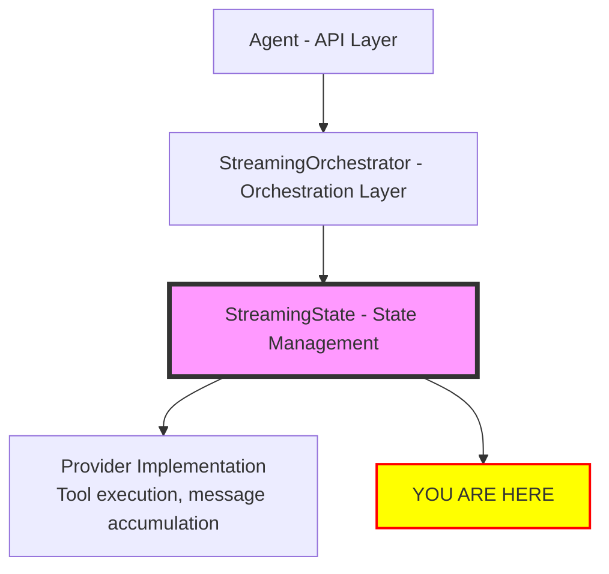
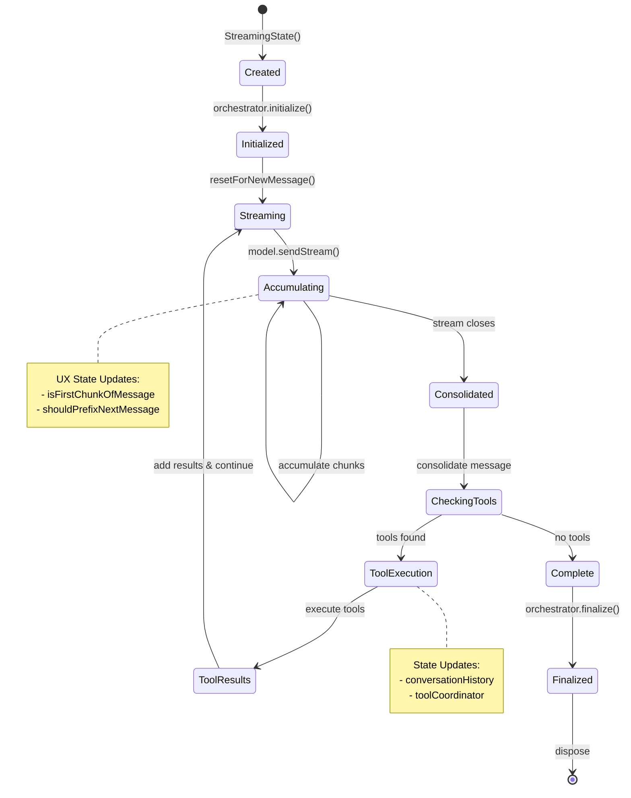
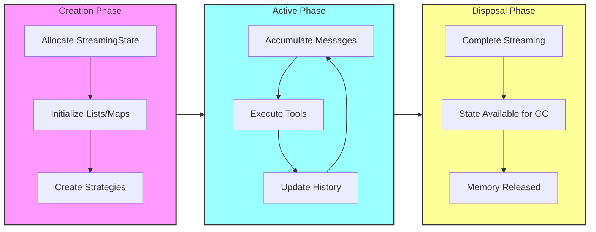
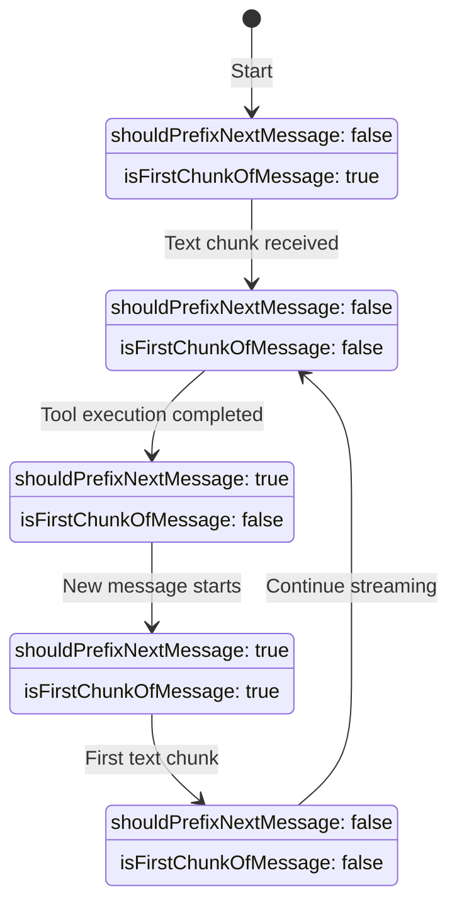
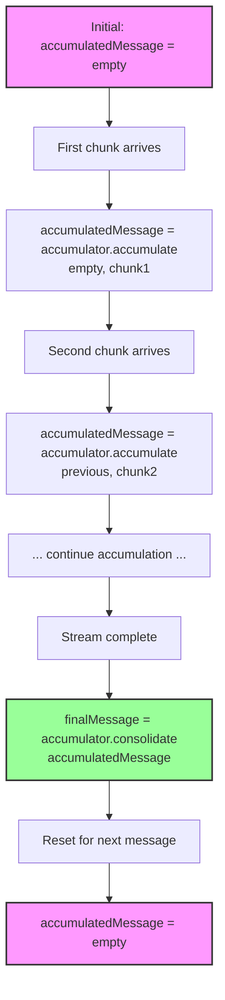

This document specifies how mutable state is managed in the dartantic_ai compatibility layer, focusing on the StreamingState system that encapsulates all state during streaming operations.

## Table of Contents
1. [Overview](#overview)
2. [Design Principles](#design-principles)
3. [StreamingState Components](#streamingstate-components)
4. [State Lifecycle](#state-lifecycle)
5. [State Isolation](#state-isolation)
6. [Strategy Pattern Integration](#strategy-pattern-integration)
7. [UX State Management](#ux-state-management)
8. [Tool Coordination State](#tool-coordination-state)
9. [Message Accumulation State](#message-accumulation-state)
10. [Error State Handling](#error-state-handling)
11. [Performance Considerations](#performance-considerations)
12. [Testing State Management](#testing-state-management)
13. [Future Enhancements](#future-enhancements)

## Overview

The state management architecture in the orchestration layer addresses the complexity of managing mutable state during streaming LLM conversations. Prior to this architecture, state was scattered across the Agent class, leading to:

- **State Leaks**: Mutable state shared between requests
- **Race Conditions**: Concurrent access to shared state
- **Complex Debugging**: State changes spread across multiple locations
- **Resource Leaks**: Incomplete cleanup of streaming state

The new architecture encapsulates all mutable state in a dedicated `StreamingState` class, providing:

- **Isolation**: Each request gets its own state instance
- **Encapsulation**: All state contained in a single object
- **Strategy Integration**: Pluggable components for different provider needs
- **Lifecycle Management**: Clear state creation, usage, and disposal patterns

### Architectural Position



## Design Principles

### 1. Encapsulation
All mutable state for a streaming operation is contained within a single `StreamingState` instance. No state leaks outside this boundary.

### 2. Isolation
Each streaming request creates its own `StreamingState` instance. No shared state between concurrent requests.

### 3. Immutability Where Possible
Fields that don't need to change are declared as `final`. Only essential streaming state is mutable.

### 4. Strategy Pattern Integration
State includes pluggable strategy components (`MessageAccumulator`, `ToolExecutor`) allowing provider-specific behavior.

### 5. Clear Lifecycle
State has well-defined creation, usage, and disposal phases with explicit transitions.

### 6. Transparency
State changes are explicit and traceable through clear method calls and field updates.

## StreamingState Components

### Core State Class

```dart
/// Encapsulates all mutable state during streaming operations
class StreamingState {
  /// Creates streaming state with required components
  StreamingState({
    required this.conversationHistory,
    required this.toolMap,
  });

  // === IMMUTABLE COMPONENTS ===
  
  /// Conversation history being built during streaming
  /// This list itself is mutable but the reference is final
  final List<ChatMessage> conversationHistory;

  /// Available tools mapped by name for O(1) lookup
  final Map<String, Tool> toolMap;

  /// Message accumulator for provider-specific streaming logic
  final MessageAccumulator accumulator = const MessageAccumulator();

  /// Tool executor for provider-specific tool execution
  final ToolExecutor executor = const ToolExecutor();

  /// Coordinator for managing tool IDs across the conversation
  final ToolIdCoordinator toolIdCoordinator = ToolIdCoordinator();

  // === WORKFLOW STATE ===
  
  /// Whether streaming workflow is complete
  bool done = false;

  /// Whether to prefix next AI message with newline for UX
  bool shouldPrefixNextMessage = false;

  /// Whether this is the first chunk of current message
  bool isFirstChunkOfMessage = true;

  // === MESSAGE ACCUMULATION STATE ===
  
  /// Message being accumulated from current stream
  ChatMessage accumulatedMessage = const ChatMessage(
    role: ChatMessageRole.model,
    parts: [],
  );

  /// Last result from model stream
  ChatResult<ChatMessage> lastResult = ChatResult<ChatMessage>(
    output: const ChatMessage(role: ChatMessageRole.model, parts: []),
    finishReason: FinishReason.unspecified,
    metadata: const <String, dynamic>{},
    usage: const LanguageModelUsage(),
  );

  // === TYPED OUTPUT STATE ===
  
  /// For typed output: metadata from suppressed tool calls
  Map<String, dynamic> suppressedToolCallMetadata = <String, dynamic>{};

  /// For typed output: text parts that were suppressed
  List<TextPart> suppressedTextParts = <TextPart>[];

  // === STATE TRANSITIONS ===
  
  /// Resets state for a new message in the conversation
  void resetForNewMessage() {
    isFirstChunkOfMessage = true;
    accumulatedMessage = const ChatMessage(
      role: ChatMessageRole.model,
      parts: [],
    );
    lastResult = ChatResult<ChatMessage>(
      output: const ChatMessage(role: ChatMessageRole.model, parts: []),
      finishReason: FinishReason.unspecified,
      metadata: const <String, dynamic>{},
      usage: const LanguageModelUsage(),
    );
  }

  /// Marks that we've started streaming content for the current message
  void markMessageStarted() {
    isFirstChunkOfMessage = false;
  }

  /// Sets the flag to prefix the next message (after tool calls)
  void requestNextMessagePrefix() {
    shouldPrefixNextMessage = true;
  }

  /// Completes the stream processing
  void complete() {
    done = true;
  }

  /// Adds a message to the conversation history
  void addToHistory(ChatMessage message) {
    conversationHistory.add(message);
  }

  // === TYPED OUTPUT SUPPORT ===
  
  /// For typed output: stores metadata from a suppressed tool call
  void addSuppressedMetadata(Map<String, dynamic> metadata) {
    suppressedToolCallMetadata.addAll(metadata);
  }

  /// For typed output: adds suppressed text parts
  void addSuppressedTextParts(List<TextPart> parts) {
    suppressedTextParts.addAll(parts);
  }

  /// For typed output: clears suppressed data after emission
  void clearSuppressedData() {
    suppressedToolCallMetadata = <String, dynamic>{};
    suppressedTextParts = <TextPart>[];
  }

  // === TOOL ID COORDINATION ===
  
  /// Resets the tool ID coordinator for a new conversation
  void resetToolIdCoordinator() {
    toolIdCoordinator.clear();
  }

  /// Registers a tool call with the coordinator
  void registerToolCall({
    required String id,
    required String name,
    Map<String, dynamic>? arguments,
  }) {
    toolIdCoordinator.registerToolCall(
      id: id,
      name: name,
      arguments: arguments,
    );
  }

  /// Validates that a tool result ID matches a registered tool call
  bool validateToolResultId(String id) =>
      toolIdCoordinator.validateToolResultId(id);
}
```

### State Components Overview

| Component | Type | Purpose | Mutability |
|-----------|------|---------|------------|
| `conversationHistory` | `List<ChatMessage>` | Complete conversation | Mutable contents, final reference |
| `toolMap` | `Map<String, Tool>` | Available tools | Immutable |
| `accumulator` | `MessageAccumulator` | Streaming strategy | Immutable |
| `executor` | `ToolExecutor` | Tool execution strategy | Immutable |
| `toolIdCoordinator` | `ToolIdCoordinator` | Tool ID management | Immutable reference, mutable state |
| `done` | `bool` | Workflow completion | Mutable |
| `shouldPrefixNextMessage` | `bool` | UX enhancement flag | Mutable |
| `isFirstChunkOfMessage` | `bool` | Chunk tracking | Mutable |
| `accumulatedMessage` | `ChatMessage` | Current message | Mutable |
| `lastResult` | `ChatResult` | Latest stream result | Mutable |

## State Lifecycle

### 1. Creation Phase

```dart
// In Agent.runStream()
final state = StreamingState(
  conversationHistory: List<ChatMessage>.from([
    ...history,
    newUserMessage,
  ]),
  toolMap: {
    for (final tool in model.tools ?? <Tool>[]) tool.name: tool,
  },
  accumulator: _selectMessageAccumulator(provider),
  executor: _selectToolExecutor(provider),
);
```

**State at Creation:**
- `conversationHistory`: Contains existing history + new user message
- `toolMap`: Pre-built map of available tools for efficient lookup
- `accumulator`: Provider-appropriate strategy for message accumulation
- `executor`: Provider-appropriate strategy for tool execution
- `done`: `false`
- `shouldPrefixNextMessage`: `false`
- `isFirstChunkOfMessage`: `true`
- `accumulatedMessage`: Empty model message
- `lastResult`: Default empty result

### 2. Initialization Phase

```dart
// In StreamingOrchestrator.initialize()
@override
void initialize(StreamingState state) {
  _logger.fine('Initializing orchestrator with state');
  state.resetForNewMessage(); // Ensure clean starting state
}
```

**State Changes:**
- `accumulatedMessage`: Reset to empty
- `isFirstChunkOfMessage`: Reset to `true`

### 3. Streaming Phase

```dart
// In orchestrator processing loop
await for (final result in model.sendStream(state.conversationHistory)) {
  // Update accumulation state
  state.accumulatedMessage = state.accumulator.accumulate(
    state.accumulatedMessage,
    result.output,
  );
  state.lastResult = result;
  
  // Update UX state on first text
  if (textOutput.isNotEmpty && state.isFirstChunkOfMessage) {
    state.markMessageStarted();
  }
}
```

**State Changes During Streaming:**
- `accumulatedMessage`: Continuously updated with new chunks
- `lastResult`: Updated with each stream result
- `isFirstChunkOfMessage`: Set to `false` after first text chunk

### 4. Consolidation Phase

```dart
// After stream closes
final consolidatedMessage = state.accumulator.consolidate(
  state.accumulatedMessage,
);

// Add to conversation
state.conversationHistory.add(consolidatedMessage);
```

**State Changes:**
- `conversationHistory`: Complete AI message added
- `accumulatedMessage`: Remains at final accumulated state

### 5. Tool Execution Phase

```dart
// If tools found
if (toolCalls.isNotEmpty) {
  final results = await state.executor.executeBatch(toolCalls, state.toolMap);
  
  // Create tool result message
  final toolResultMessage = ChatMessage(
    role: ChatMessageRole.user,
    parts: toolResultParts,
  );
  
  state.conversationHistory.add(toolResultMessage);
  state.setToolExecutionComplete(); // Set UX flag
}
```

**State Changes:**
- `conversationHistory`: Tool result message added
- `shouldPrefixNextMessage`: Set to `true` for UX enhancement

### 6. Completion Phase

```dart
// When workflow complete
if (noMoreTools) {
  state.markDone();
}
```

**State Changes:**
- `done`: Set to `true`

### 7. Finalization Phase

```dart
// In StreamingOrchestrator.finalize()
@override
void finalize(StreamingState state) {
  _logger.fine('Finalizing orchestrator, final state: ${state.toDebugInfo()}');
  // State cleanup if needed (currently none required)
}
```

**State at Finalization:**
- All changes preserved for final result
- Ready for disposal with request completion

### State Lifecycle Diagram



### Memory Lifecycle Diagram



## State Isolation

### Request-Level Isolation

Each streaming request creates its own `StreamingState` instance:

```dart
// Request 1
final state1 = StreamingState(
  conversationHistory: [...],
  toolMap: {...},
);

// Request 2 (concurrent) - completely isolated
final state2 = StreamingState(
  conversationHistory: [...],
  toolMap: {...},
);

// No shared state between requests
assert(state1 != state2);
assert(state1.conversationHistory != state2.conversationHistory);
```

### Thread Safety

While Dart is single-threaded, async operations can interleave. State isolation prevents issues:

```dart
// Safe concurrent streaming
final futures = [
  agent1.runStream('Question 1'),
  agent2.runStream('Question 2'),
  agent3.runStream('Question 3'),
];

// Each creates isolated state
await Future.wait(futures); // No state conflicts
```

### Memory Isolation

Each state maintains its own memory space:

```dart
class StreamingState {
  // Each instance has its own conversation list
  final List<ChatMessage> conversationHistory;
  
  // Each instance has its own tool map
  final Map<String, Tool> toolMap;
  
  // Each instance has its own accumulation state
  ChatMessage accumulatedMessage;
}
```

## Strategy Pattern Integration

### MessageAccumulator Integration

```dart
/// State delegates message accumulation to strategy
class StreamingState {
  final MessageAccumulator accumulator;
  
  void accumulateChunk(ChatMessage chunk) {
    accumulatedMessage = accumulator.accumulate(accumulatedMessage, chunk);
  }
  
  ChatMessage consolidateMessage() {
    return accumulator.consolidate(accumulatedMessage);
  }
}
```

### ToolExecutor Integration

```dart
/// State delegates tool execution to strategy
class StreamingState {
  final ToolExecutor executor;
  
  Future<List<ToolExecutionResult>> executeTools(List<ToolPart> toolCalls) {
    return executor.executeBatch(toolCalls, toolMap);
  }
}
```

### Strategy Selection

```dart
/// State created with appropriate strategies
StreamingState createState({
  required ChatProvider provider,
  required List<Tool> tools,
}) {
  return StreamingState(
    conversationHistory: [],
    toolMap: {for (final tool in tools) tool.name: tool},
    accumulator: _selectAccumulator(provider),
    executor: _selectExecutor(provider),
  );
}

MessageAccumulator _selectAccumulator(ChatProvider provider) {
  switch (provider.name) {
    case 'anthropic':
      return const AnthropicMessageAccumulator();
    case 'openai':
      return const OpenAIMessageAccumulator();
    default:
      return const DefaultMessageAccumulator();
  }
}
```

## UX State Management

### Newline Prefixing State

The state tracks UX enhancement for message separation:

```dart
class StreamingState {
  /// Whether to prefix next AI message with newline
  bool shouldPrefixNextMessage = false;
  
  /// Whether this is first chunk of current message
  bool isFirstChunkOfMessage = true;
  
  /// Check if newline prefix needed
  bool shouldAddNewlinePrefix() {
    return shouldPrefixNextMessage && isFirstChunkOfMessage;
  }
  
  /// Mark message streaming started
  void markMessageStarted() {
    isFirstChunkOfMessage = false;
  }
  
  /// Set flag after tool execution
  void setToolExecutionComplete() {
    shouldPrefixNextMessage = true;
  }
}
```

### UX State Transitions



### UX Enhancement in Action

```dart
// In orchestrator processing
if (textOutput.isNotEmpty) {
  final shouldPrefix = state.shouldAddNewlinePrefix();
  final streamOutput = shouldPrefix ? '\n$textOutput' : textOutput;
  
  state.markMessageStarted(); // Update UX state
  
  yield StreamingIterationResult(
    output: streamOutput,
    // ...
  );
}
```

## Tool Coordination State

### ToolIdCoordinator

```dart
/// Manages tool ID generation and tracking
class ToolIdCoordinator {
  final Map<String, int> _toolCounts = {};
  final Set<String> _usedIds = {};
  
  /// Generate unique ID for tool call
  String generateId(String toolName) {
    final count = _toolCounts[toolName] = (_toolCounts[toolName] ?? 0) + 1;
    final id = '${toolName}_$count';
    
    // Ensure uniqueness
    var uniqueId = id;
    var suffix = 0;
    while (_usedIds.contains(uniqueId)) {
      uniqueId = '${id}_${suffix++}';
    }
    
    _usedIds.add(uniqueId);
    return uniqueId;
  }
  
  /// Check if ID already used
  bool isIdUsed(String id) => _usedIds.contains(id);
  
  /// Record external ID (from provider)
  void recordId(String id) => _usedIds.add(id);
}
```

### Tool State Integration

```dart
class StreamingState {
  final ToolIdCoordinator toolIdCoordinator = ToolIdCoordinator();
  
  /// Generate unique tool ID
  String generateToolId(String toolName) {
    return toolIdCoordinator.generateId(toolName);
  }
  
  /// Record tool ID from provider
  void recordToolId(String id) {
    toolIdCoordinator.recordId(id);
  }
}
```

## Message Accumulation State

### Accumulation Process

```dart
/// Message accumulation state tracking
class StreamingState {
  ChatMessage accumulatedMessage = const ChatMessage(
    role: ChatMessageRole.model,
    parts: [],
  );
  
  /// Accumulate chunk into current message
  void accumulateChunk(ChatMessage chunk) {
    accumulatedMessage = accumulator.accumulate(accumulatedMessage, chunk);
  }
  
  /// Get final consolidated message
  ChatMessage getConsolidatedMessage() {
    return accumulator.consolidate(accumulatedMessage);
  }
  
  /// Reset accumulation for new message
  void resetAccumulation() {
    accumulatedMessage = const ChatMessage(
      role: ChatMessageRole.model,
      parts: [],
    );
  }
}
```

### Accumulation State Flow



## Error State Handling

### Error State Preservation

```dart
/// Error state information
class StreamingState {
  Exception? lastError;
  String? errorContext;
  
  /// Record error with context
  void recordError(Exception error, String context) {
    lastError = error;
    errorContext = context;
  }
  
  /// Clear error state
  void clearError() {
    lastError = null;
    errorContext = null;
  }
  
  /// Check if in error state
  bool get hasError => lastError != null;
}
```

### Error Recovery

```dart
// In orchestrator error handling
try {
  await for (final result in model.sendStream(state.conversationHistory)) {
    // Process normally
  }
} on Exception catch (error) {
  state.recordError(error, 'model_streaming');
  
  // Create error result
  yield StreamingIterationResult(
    output: '',
    messages: [_createErrorMessage(error)],
    shouldContinue: false,
    finishReason: FinishReason.error,
    metadata: {'error': error.toString()},
    usage: const LanguageModelUsage(),
    id: 'error_${DateTime.now().millisecondsSinceEpoch}',
  );
}
```

## Performance Considerations

### Efficient State Updates

```dart
/// Optimized state updates
class StreamingState {
  // Use efficient data structures
  final List<ChatMessage> conversationHistory; // Direct list access
  final Map<String, Tool> toolMap; // O(1) tool lookup
  
  // Minimize allocations
  void resetForNewMessage() {
    // Reuse empty message constant
    accumulatedMessage = const ChatMessage(
      role: ChatMessageRole.model,
      parts: [], // Empty list reuse
    );
    isFirstChunkOfMessage = true; // Simple boolean update
  }
  
  // Efficient accumulation
  void accumulateChunk(ChatMessage chunk) {
    // Delegate to strategy for optimized accumulation
    accumulatedMessage = accumulator.accumulate(accumulatedMessage, chunk);
  }
}
```

### Memory Management

```dart
/// Memory-efficient state management
class StreamingState {
  // Pre-size collections when possible
  StreamingState({
    required this.conversationHistory,
    required this.toolMap,
    // ...
  }) {
    // Pre-size conversation history if known
    if (conversationHistory.isEmpty) {
      conversationHistory.capacity = 10; // Reasonable default
    }
  }
  
  /// Cleanup resources (if needed in future)
  void dispose() {
    // Currently no cleanup needed, but hook available
    // Could clear large data structures, close streams, etc.
  }
}
```

### State Size Monitoring

```dart
/// Monitor state size for performance
class StreamingState {
  /// Get memory usage estimate
  int get estimatedMemoryUsage {
    var size = 0;
    
    // Conversation history size
    for (final message in conversationHistory) {
      size += _estimateMessageSize(message);
    }
    
    // Tool map size
    size += toolMap.length * 100; // Rough estimate
    
    // Accumulated message size
    size += _estimateMessageSize(accumulatedMessage);
    
    return size;
  }
  
  int _estimateMessageSize(ChatMessage message) {
    var size = 0;
    for (final part in message.parts) {
      if (part is TextPart) {
        size += part.text.length * 2; // UTF-16 encoding
      } else if (part is DataPart) {
        size += part.bytes.length;
      }
      // Add other part types as needed
    }
    return size;
  }
}
```

## Testing State Management

### Unit Testing State

```dart
void main() {
  group('StreamingState', () {
    late StreamingState state;
    
    setUp(() {
      state = StreamingState(
        conversationHistory: [],
        toolMap: {'test_tool': mockTool},
      );
    });
    
    test('initializes with correct defaults', () {
      expect(state.done, false);
      expect(state.shouldPrefixNextMessage, false);
      expect(state.isFirstChunkOfMessage, true);
      expect(state.accumulatedMessage.parts, isEmpty);
    });
    
    test('resetForNewMessage clears state correctly', () {
      // Set up state
      state.accumulatedMessage = ChatMessage.modelText('accumulated');
      state.isFirstChunkOfMessage = false;
      
      // Reset
      state.resetForNewMessage();
      
      // Verify reset
      expect(state.accumulatedMessage.parts, isEmpty);
      expect(state.isFirstChunkOfMessage, true);
    });
    
    test('markMessageStarted updates UX state', () {
      expect(state.isFirstChunkOfMessage, true);
      
      state.markMessageStarted();
      
      expect(state.isFirstChunkOfMessage, false);
    });
    
    test('setToolExecutionComplete sets UX flag', () {
      expect(state.shouldPrefixNextMessage, false);
      
      state.setToolExecutionComplete();
      
      expect(state.shouldPrefixNextMessage, true);
    });
  });
}
```

### Integration Testing

```dart
void main() {
  group('State Integration', () {
    test('state isolation between concurrent requests', () async {
      final agent1 = Agent('openai:gpt-4o-mini');
      final agent2 = Agent('anthropic:claude-3-5-sonnet');
      
      // Start concurrent requests
      final future1 = agent1.runStream('Request 1').toList();
      final future2 = agent2.runStream('Request 2').toList();
      
      final results = await Future.wait([future1, future2]);
      
      // Verify both completed successfully (no state conflicts)
      expect(results[0].isNotEmpty, true);
      expect(results[1].isNotEmpty, true);
    });
    
    test('state preserved across tool execution', () async {
      final agent = Agent('openai:gpt-4o-mini', tools: [weatherTool]);
      
      final messages = <ChatMessage>[];
      await for (final result in agent.runStream('Weather in NYC?')) {
        messages.addAll(result.messages);
      }
      
      // Verify state progression
      expect(messages.length, greaterThanOrEqualTo(3)); // User + AI + Tools + AI
      expect(messages[0].role, ChatMessageRole.user);
      expect(messages[1].role, ChatMessageRole.model);
      // Tool results and final response...
    });
  });
}
```

### State Invariant Testing

```dart
void main() {
  group('State Invariants', () {
    test('conversation history maintains user/model alternation', () async {
      final agent = Agent('openai:gpt-4o-mini', tools: [calculatorTool]);
      
      final allMessages = <ChatMessage>[];
      await for (final result in agent.runStream('What is 2+2?')) {
        allMessages.addAll(result.messages);
      }
      
      // Verify message alternation invariant
      // Message validation is handled by the model layer
    });
    
    test('tool map remains immutable during streaming', () async {
      final originalTools = [weatherTool, calculatorTool];
      final agent = Agent('openai:gpt-4o-mini', tools: originalTools);
      
      await for (final result in agent.runStream('Use tools')) {
        // Tool map should never change during streaming
      }
      
      expect(agent.tools, equals(originalTools));
    });
  });
}
```

## Future Enhancements

### Persistent State

```dart
/// Future: Persistent state across conversations
class PersistentStreamingState extends StreamingState {
  final StateStorage storage;
  
  /// Save state to persistent storage
  Future<void> save() async {
    await storage.save(toJson());
  }
  
  /// Load state from persistent storage
  static Future<PersistentStreamingState> load(StateStorage storage) async {
    final data = await storage.load();
    return PersistentStreamingState.fromJson(data);
  }
}
```

### State Snapshots

```dart
/// Future: State snapshots for debugging/replay
class StreamingState {
  final List<StateSnapshot> _snapshots = [];
  
  /// Create snapshot of current state
  StateSnapshot createSnapshot(String label) {
    final snapshot = StateSnapshot(
      label: label,
      timestamp: DateTime.now(),
      conversationLength: conversationHistory.length,
      accumulatedParts: accumulatedMessage.parts.length,
      flags: {
        'done': done,
        'shouldPrefixNextMessage': shouldPrefixNextMessage,
        'isFirstChunkOfMessage': isFirstChunkOfMessage,
      },
    );
    _snapshots.add(snapshot);
    return snapshot;
  }
  
  /// Get all snapshots
  List<StateSnapshot> get snapshots => List.unmodifiable(_snapshots);
}
```

### State Metrics

```dart
/// Future: State metrics for performance monitoring
class StreamingState {
  final StateMetrics metrics = StateMetrics();
  
  void recordStateChange(String operation, Duration duration) {
    metrics.recordOperation(operation, duration);
  }
  
  void recordMemoryUsage() {
    metrics.recordMemory(estimatedMemoryUsage);
  }
}

class StateMetrics {
  final Map<String, List<Duration>> operationTimes = {};
  final List<int> memoryUsage = [];
  
  void recordOperation(String operation, Duration duration) {
    operationTimes.putIfAbsent(operation, () => []).add(duration);
  }
  
  void recordMemory(int usage) {
    memoryUsage.add(usage);
  }
  
  Map<String, dynamic> getSummary() {
    return {
      'operations': operationTimes.map((op, times) => MapEntry(op, {
        'count': times.length,
        'averageMs': times.map((t) => t.inMilliseconds).reduce((a, b) => a + b) / times.length,
        'maxMs': times.map((t) => t.inMilliseconds).reduce((a, b) => a > b ? a : b),
      })),
      'memory': {
        'samples': memoryUsage.length,
        'maxBytes': memoryUsage.isNotEmpty ? memoryUsage.reduce((a, b) => a > b ? a : b) : 0,
        'avgBytes': memoryUsage.isNotEmpty ? memoryUsage.reduce((a, b) => a + b) / memoryUsage.length : 0,
      },
    };
  }
}
```

---

This state management architecture provides a robust foundation for handling complex streaming workflows while maintaining clean isolation, performance, and debuggability. The encapsulation of all mutable state in `StreamingState` eliminates the state management issues that plagued the previous monolithic design and enables reliable concurrent operations across multiple streaming requests.
