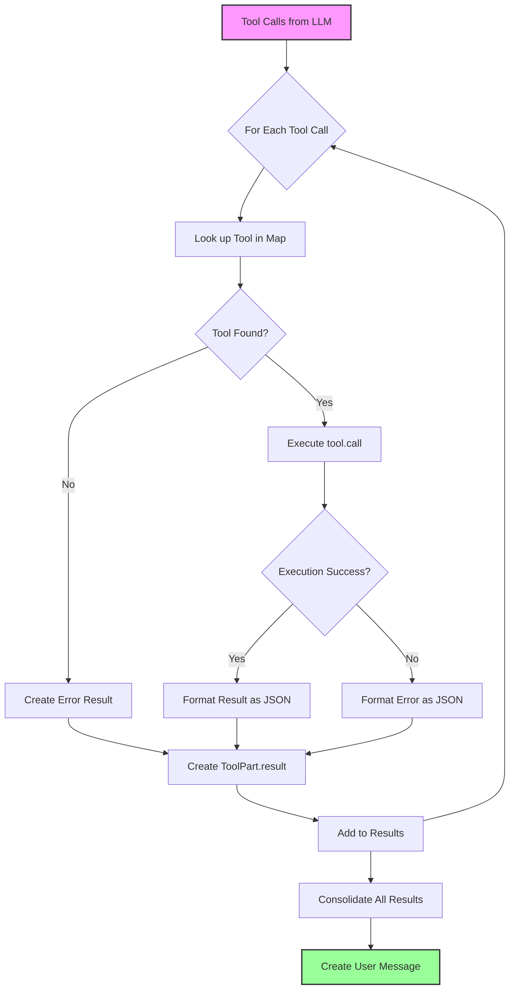
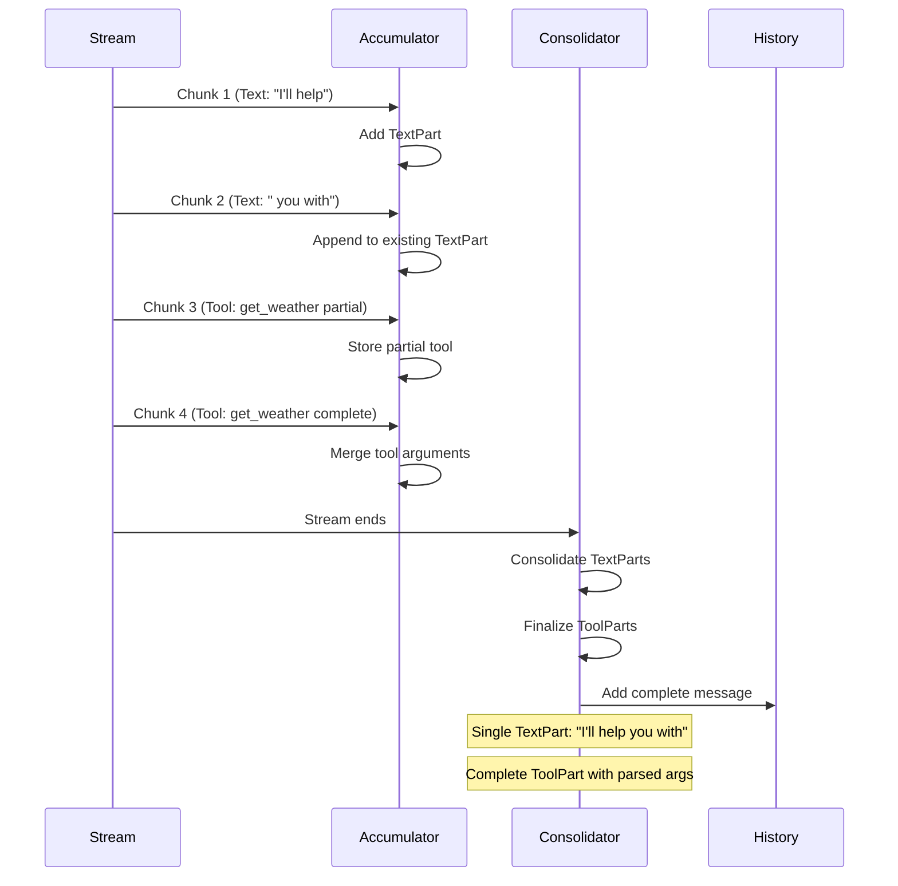
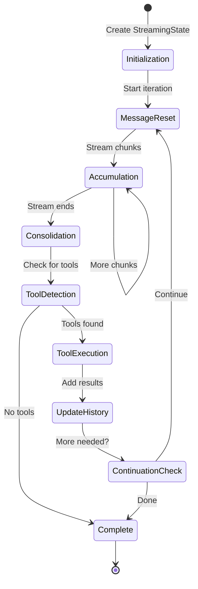
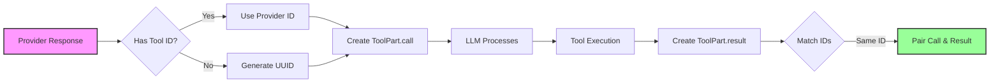

This document specifies how the dartantic_ai compatibility layer handles streaming messages and tool calls across different providers using the new orchestrator-based architecture.

## Table of Contents
1. [Architecture Overview](#architecture-overview)
2. [Core Concepts](#core-concepts)
3. [Provider Capabilities](#provider-capabilities)
4. [Streaming Patterns](#streaming-patterns)
5. [Orchestration Layer](#orchestration-layer)
6. [Tool Execution Layer](#tool-execution-layer)
7. [State Management](#state-management)
8. [Implementation Details](#implementation-details)
9. [Provider-Specific Details](#provider-specific-details)
10. [Testing and Validation](#testing-and-validation)

## Architecture Overview

The system operates through a six-layer architecture with specialized components for streaming and tool execution:

```mermaid
flowchart TB
    subgraph API["API Layer"]
        A1["Agent: User-facing interface (run/runStream)"]
        A2["Orchestrator selection and coordination"]
        A3["Final result formatting and validation"]
    end
    
    subgraph ORCH["Orchestration Layer"]
        O1["StreamingOrchestrator: Workflow coordination"]
        O2["Business logic and streaming management"]
        O3["Provider-agnostic tool execution orchestration"]
        O4["Streaming state transitions and UX enhancement"]
    end
    
    subgraph PABS["Provider Abstraction Layer"]
        P1["ChatModel: Provider-agnostic interface"]
        P2["MessageAccumulator: Provider-specific message accumulation"]
        P3["ProviderCaps: Capability-based feature detection"]
    end
    
    subgraph PIMP["Provider Implementation Layer"]
        I1["Provider-specific models and mappers"]
        I2["Protocol-specific streaming accumulation"]
        I3["Tool ID assignment and argument handling"]
    end
    
    subgraph INFRA["Infrastructure Layer"]
        N1["ToolExecutor: Centralized tool execution"]
        N2["StreamingState: Mutable state encapsulation"]
        N3["Resource management via try/finally patterns"]
        N4["RetryHttpClient: Cross-cutting HTTP concerns"]
    end
    
    subgraph PROTO["Protocol Layer"]
        R1["HTTP clients for each provider"]
        R2["Network communication and error handling"]
        R3["Request/response serialization"]
    end
    
    API --> ORCH
    ORCH --> PABS
    PABS --> PIMP
    PIMP --> INFRA
    INFRA --> PROTO
    
    style API fill:#f9f,stroke:#333,stroke-width:2px
    style ORCH fill:#bbf,stroke:#333,stroke-width:2px
    style PABS fill:#bfb,stroke:#333,stroke-width:2px
    style PIMP fill:#fbf,stroke:#333,stroke-width:2px
    style INFRA fill:#ffb,stroke:#333,stroke-width:2px
    style PROTO fill:#fbb,stroke:#333,stroke-width:2px
```



## Core Concepts

### Streaming Message Flow
- **Text Streaming**: Immediate output of text chunks to users
- **Tool Accumulation**: Building complete tool calls across chunks
- **Message Boundaries**: Preserving complete messages in history
- **Streaming UX**: Visual separation between tool calls and responses

### Tool Execution
- **Tool Calls**: LLM-initiated function invocations with structured arguments
- **Tool Results**: Responses from tool execution returned to LLM
- **ID Matching**: Ensuring tool calls and results are properly paired
- **Error Handling**: Tool errors returned to LLM for recovery

## Provider Capabilities

### Tool Support Matrix

| Provider   | Streaming | Tools | Tool IDs | Streaming Format |
|------------|-----------|-------|----------|------------------|
| OpenAI     | ✅        | ✅    | ✅       | Partial chunks   |
| OpenRouter | ✅        | ✅    | ✅       | OpenAI-compatible|
| Anthropic  | ✅        | ✅    | ✅       | Event-based      |
| Google     | ✅        | ✅    | ❌       | Complete chunks  |
| Ollama     | ✅        | ✅    | ❌       | Complete chunks  |
| Mistral    | ✅        | ❌    | N/A      | Text only        |
| Cohere     | ✅        | ✅    | ✅       | Custom format    |
| Together   | ✅        | ✅    | ✅       | OpenAI-compatible|

## Streaming Patterns

### OpenAI-Style (Partial Chunks)
Tool calls are built incrementally across multiple chunks, with arguments accumulating across chunks.

### Google/Ollama-Style (Complete Chunks)
Each chunk contains complete information with already parsed arguments.

### Anthropic-Style (Event-Based)
Structured event sequence with state tracking across events.

## Orchestration Layer

### StreamingOrchestrator Interface

The orchestration layer coordinates streaming workflows through the `StreamingOrchestrator` interface.
    ChatModel<ChatModelOptions> model,
    StreamingState state, {
    JsonSchema? outputSchema,
  });
  
  /// Finalize the orchestrator after streaming completes
  void finalize(StreamingState state);
}
```

### Orchestrator Selection

The Agent selects the appropriate orchestrator based on request characteristics:

```dart
StreamingOrchestrator _selectOrchestrator({
  JsonSchema? outputSchema,
  List<Tool>? tools,
}) {
  // Select TypedOutputStreamingOrchestrator for structured output
  if (outputSchema != null) {
    return const TypedOutputStreamingOrchestrator();
  }
  
  // Default orchestrator for regular chat and tool calls
  return const DefaultStreamingOrchestrator();
}
```

### DefaultStreamingOrchestrator

Handles standard streaming patterns:

1. **Stream Model Response**: Process chunks until stream closes
2. **Message Accumulation**: Use MessageAccumulator strategy
3. **Tool Detection**: Identify tool calls in consolidated message
4. **Tool Execution**: Delegate to ToolExecutor
5. **Continuation Logic**: Loop until no more tool calls

```dart
// Main iteration pattern
await for (final result in model.sendStream(state.conversationHistory)) {
  // Stream text chunks immediately
  if (textOutput.isNotEmpty) {
    yield StreamingIterationResult(output: textOutput, shouldContinue: true);
  }
  
  // Accumulate complete message
  state.accumulatedMessage = state.accumulator.accumulate(
    state.accumulatedMessage,
    result.output,
  );
}

// Process consolidated message
final consolidatedMessage = state.accumulator.consolidate(state.accumulatedMessage);
final toolCalls = consolidatedMessage.parts.whereType<ToolPart>()
    .where((p) => p.kind == ToolPartKind.call).toList();

if (toolCalls.isNotEmpty) {
  // Execute tools and continue streaming
  final results = await state.executor.executeBatch(toolCalls, state.toolMap);
  // ... add results to conversation and continue
}
```

## Tool Execution Layer

### ToolExecutor Class

Centralized tool execution with robust error handling:

```dart
class ToolExecutor {
  /// Execute multiple tools sequentially
  Future<List<ToolExecutionResult>> executeBatch(
    List<ToolPart> toolCalls,
    Map<String, Tool> toolMap,
  );
  
  /// Execute a single tool with error handling
  Future<ToolExecutionResult> executeSingle(
    ToolPart toolCall,
    Map<String, Tool> toolMap,
  );
}
```

### ToolExecutor Implementation

The ToolExecutor handles tool execution with robust error handling, argument extraction, and result consolidation.

### Tool Execution Flow



## State Management

### Message Accumulation Flow



### StreamingState

Encapsulates all mutable state during streaming operations:

```dart
class StreamingState {
  /// Conversation history being built during streaming
  final List<ChatMessage> conversationHistory;
  
  /// Available tools mapped by name
  final Map<String, Tool> toolMap;
  
  /// Provider-specific message accumulation
  final MessageAccumulator accumulator;
  
  /// Tool execution handler
  final ToolExecutor executor;
  
  /// Tool ID coordination across conversation
  final ToolIdCoordinator toolIdCoordinator;
  
  /// Workflow control flags
  bool done = false;
  bool shouldPrefixNextMessage = false;
  bool isFirstChunkOfMessage = true;
  
  /// Current message being accumulated from stream
  ChatMessage accumulatedMessage;
  
  /// Last result from model stream
  ChatResult<ChatMessage> lastResult;
}
```

### State Lifecycle



1. **Initialization**: Create state with conversation history and tools
2. **Message Reset**: Clear accumulated message before each model call
3. **Accumulation**: Build message from streaming chunks
4. **Consolidation**: Finalize message and extract tool calls
5. **Tool Execution**: Process tools and update conversation
6. **Continuation**: Check if more streaming needed

### UX State Management

```dart
// Streaming UX enhancement tracking
bool _shouldPrefixNewline(StreamingState state) {
  return state.shouldPrefixNextMessage && state.isFirstChunkOfMessage;
}

// Update state after streaming text
void _updateStreamingState(StreamingState state, String textOutput) {
  if (textOutput.isNotEmpty) {
    state.isFirstChunkOfMessage = false;
  }
}

// Set UX flags after tool execution
void _setToolExecutionFlags(StreamingState state) {
  state.shouldPrefixNextMessage = true; // Next AI message needs newline prefix
}
```

## Implementation Details

### Tool ID Assignment

For providers without tool IDs (Google, Ollama):

```dart
// In mapper
final toolId = Uuid().v4();
return ToolPart.call(
  id: toolId,
  name: functionCall.name,
  arguments: functionCall.args,
);
```

### Tool ID Coordination Flow



### Argument Handling

All mappers handle arguments consistently:

```dart
// OpenAI mapper
// Accumulates raw JSON during streaming, parses when complete
arguments: json.decode(argumentsAccumulator.toString())

// Anthropic transformer  
// Accumulates raw JSON during streaming, parses when complete
arguments: json.decode(argsJson)

// Google/Ollama mapper
// Arguments already parsed by provider
arguments: functionCall.args
```

### Error Handling

Tool execution errors are included in the consolidated tool result message:

```dart
catch (error, stackTrace) {
  _logger.warning('Tool ${toolPart.name} execution failed: $error');
  
  // Add error result part to collection
  toolResultParts.add(
    ToolPart.result(
      id: toolPart.id,
      name: toolPart.name,
      result: json.encode({'error': error.toString()}),
    ),
  );
}
```

## Provider-Specific Details

### OpenAI
- **Streaming**: Partial chunks with index-based accumulation
- **Tool IDs**: Provided by API
- **Arguments**: Streamed as raw JSON string, parsed by mapper when complete
- **ToolPart Creation**: Only after streaming completes with parsed arguments

### Anthropic
- **Streaming**: Event-based with explicit stages
- **Tool IDs**: Provided by API
- **Arguments**: Accumulated via InputJsonBlockDelta
- **Special**: ContentBlockStop triggers emission

### Google
- **Streaming**: Complete chunks per message
- **Tool IDs**: Generated by mapper (UUID)
- **Arguments**: Provided as parsed objects
- **Conversion**: Mapper converts to JSON string

### Ollama
- **Streaming**: Complete chunks
- **Tool IDs**: Generated by mapper (UUID)
- **Arguments**: Provided as parsed objects
- **Note**: Both native and OpenAI-compatible endpoints

### Cohere
- **Streaming**: Custom format with <|python_tag|>
- **Tool IDs**: Provided by API
- **Arguments**: Special parsing for "null" string
- **Edge Case**: Sends "null" for parameterless tools

## Testing and Validation

### Key Test Scenarios

1. **Streaming Integrity**: No dropped chunks or text
2. **Tool Accumulation**: Arguments built correctly across chunks
3. **ID Matching**: Tool calls and results properly paired
4. **Error Recovery**: Tool errors handled gracefully
5. **UX Features**: Newline prefixing works correctly
6. **Message History Validation**: User/model alternation maintained
7. **Tool Result Consolidation**: Multiple results in single message

### Debug Examples

```dart
// debug_streaming_tool_calls.dart
// Tests streaming with multiple tool calls

// debug_tool_accumulation.dart
// Verifies argument accumulation across chunks
```

### Edge Cases

1. **Empty Arguments**: Some providers send `arguments: {}` - handled as empty map
2. **Parameterless Tools**: Cohere sends `"null"` string - parsed to empty map
3. **Multiple Same Tools**: Ensure IDs differentiate calls
4. **Streaming Interruption**: Partial tool calls not exposed until complete

## Key Design Principles

1. **Streaming First**: Optimize for real-time user experience
2. **Orchestrator Coordination**: Complex workflows handled by specialized orchestrators
3. **State Encapsulation**: All mutable state isolated in StreamingState
4. **Provider Abstraction**: MessageAccumulator handles provider-specific streaming
5. **Provider Abstraction**: Agent and orchestrators agnostic to provider details
6. **Complete Tool Calls**: ToolPart only created when arguments are fully parsed
6. **Resource Management**: Guaranteed cleanup through try/finally patterns
7. **Error Transparency**: Tool errors returned to LLM with full context
8. **Clean Separation**: Each layer has focused responsibilities

## Architecture Benefits

### Compared to Previous Monolithic Design

1. **Maintainability**: 56% reduction in Agent complexity (1,091 → 475 lines)
2. **Testability**: Each component can be tested in isolation
3. **Extensibility**: New orchestrators and executors can be added without changing core logic
4. **Debugging**: Clear layer boundaries make issue isolation easier
5. **Resource Safety**: Centralized lifecycle management prevents leaks
6. **Provider Isolation**: Quirks contained in implementation layers

### Orchestrator Advantages

1. **Workflow Specialization**: Different orchestrators for different use cases
2. **Provider Agnostic**: Same orchestrator works across all providers
3. **Streaming Optimization**: Purpose-built for streaming coordination
4. **State Management**: Clean state transitions and isolation
5. **UX Enhancement**: Consistent streaming experience across providers


## Future Considerations

### Planned Enhancements

1. **Parallel Tool Execution**: ParallelToolExecutor for concurrent tool calls
2. **Custom Orchestrators**: Provider-specific orchestrators for unique workflows
3. **Advanced State Management**: Persistent state across conversations
4. **Performance Monitoring**: Built-in metrics and monitoring hooks
5. **Caching Integration**: Smart caching strategies in orchestration layer

### Extension Points

1. **New Orchestrators**: Specialized workflows (e.g., multi-step reasoning)
2. **Tool Execution**: Extensions to the ToolExecutor class
3. **Message Accumulators**: Novel streaming patterns and optimizations
4. **State Managers**: Advanced state persistence and recovery
5. **Lifecycle Hooks**: Custom resource management and cleanup logic

## Implementation Guidance

### Adding New Orchestrators

```dart
class CustomStreamingOrchestrator implements StreamingOrchestrator {
  @override
  String get providerHint => 'custom';
  
  @override
  void initialize(StreamingState state) {
    // Custom initialization logic
  }
  
  @override
  Stream<StreamingIterationResult> processIteration(
    ChatModel<ChatModelOptions> model,
    StreamingState state, {
    JsonSchema? outputSchema,
  }) async* {
    // Custom streaming workflow
  }
  
  @override
  void finalize(StreamingState state) {
    // Custom cleanup logic
  }
}
```

### Extending Tool Execution

```dart
// Example: Adding parallel execution to ToolExecutor
class ParallelToolExecutor extends ToolExecutor {
  @override
  Future<List<ToolExecutionResult>> executeBatch(
    List<ToolPart> toolCalls,
    Map<String, Tool> toolMap,
  ) async {
    // Execute tools in parallel using Future.wait
    final futures = toolCalls.map((call) => executeSingle(call, toolMap));
    return await Future.wait(futures);
  }
}
```

### Custom Message Accumulators

```dart
class OptimizedMessageAccumulator extends MessageAccumulator {
  @override
  String get providerHint => 'optimized';
  
  @override
  ChatMessage accumulate(ChatMessage existing, ChatMessage newChunk) {
    // Provider-specific accumulation optimizations
  }
  
  @override
  ChatMessage consolidate(ChatMessage accumulated) {
    // Final message processing and optimization
  }
}
