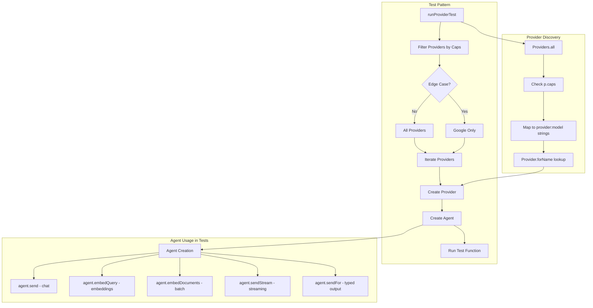

## Environment Setup for Tests

### Required API Keys

To run the full test suite successfully, you'll need to set the following environment variables with valid API keys:

1. **OPENAI_API_KEY** - For OpenAI provider
2. **ANTHROPIC_API_KEY** - For Anthropic/Claude provider  
3. **GEMINI_API_KEY** - For Google Gemini provider
4. **MISTRAL_API_KEY** - For Mistral provider
5. **COHERE_API_KEY** - For Cohere provider
6. **OPENROUTER_API_KEY** - For OpenRouter provider (access to 300+ models)
7. **TOGETHER_API_KEY** - For Together AI provider
8. **LAMBDA_API_KEY** - For Lambda provider (if using)

Note: The following providers do not require API keys:
- **ollama** - Runs locally
- **ollama-openai** - Uses local Ollama instance
- **google-openai** - Uses GEMINI_API_KEY (same as google provider)

### Setting Up Environment Variables

You can set these environment variables in several ways:

1. **Export in shell** (temporary):
   ```bash
   export OPENAI_API_KEY="your-key-here"
   export ANTHROPIC_API_KEY="your-key-here"
   # ... etc
   ```

2. **Add to shell profile** (permanent):
   ```bash
   # Add to ~/.bashrc, ~/.zshrc, or equivalent
   export OPENAI_API_KEY="your-key-here"
   export ANTHROPIC_API_KEY="your-key-here"
   # ... etc
   ```

3. **Use a .env file** (project-specific):
   Create a `.env` file in the project root with:
   ```
   OPENAI_API_KEY=your-key-here
   ANTHROPIC_API_KEY=your-key-here
   # ... etc
   ```

### Running Tests

Once environment variables are set:

```bash
# Run all tests
dart test

# Run specific test file
dart test test/chat_models_test.dart

# Run with specific provider
OPENAI_API_KEY=sk-xxx dart test test/embeddings_test.dart
```

## Core Testing Philosophy

### Testing Principles

1. **Exception Transparency**: DO NOT catch exceptions - let them bubble up for diagnosis
2. **Capability-Based Filtering**: DO NOT add provider filtering except by capabilities (e.g. ProviderCaps)
3. **No Performance Testing**: DO NOT add performance tests
4. **No Regression Testing**: DO NOT add regression tests
5. **80% Coverage**: Common usage patterns tested across ALL capable providers
6. **Edge Case Isolation**: Rare scenarios tested on Google only to avoid timeouts
7. **Single Responsibility**: Each functionality should only be tested in ONE file - no duplication

### Required Test File Header

**CRITICAL: This header MUST appear at the top of EVERY test file:**

```dart
/// TESTING PHILOSOPHY:
/// 1. DO NOT catch exceptions - let them bubble up for diagnosis
/// 2. DO NOT add provider filtering except by capabilities (e.g. ProviderCaps)
/// 3. DO NOT add performance tests
/// 4. DO NOT add regression tests
/// 5. 80% cases = common usage patterns tested across ALL capable providers
/// 6. Edge cases = rare scenarios tested on Google only to avoid timeouts
/// 7. Each functionality should only be tested in ONE file - no duplication
```

## Complete Functionality Areas (18 total)

Based on comprehensive analysis of lib/dartantic_ai.dart and the entire codebase:

### 1. **Chat Models** (lib/src/chat/)
   **80% Cases:**
   - Basic chat completions
   - Multi-turn conversations
   - System messages in history
   
   **Edge Cases:**
   - Empty/null inputs
   - Unicode/emoji handling

### 2. **Embeddings** (lib/src/embeddings/)
   **80% Cases:**
   - Text embeddings generation
   - Document embeddings
   - Similarity calculations
   
   **Edge Cases:**
   - Empty text handling

### 3. **Tool Calling** (lib/src/tools/)
   **80% Cases:**
   - Single tool calls
   - Multiple tool calls in sequence
   - Tool result handling
   - Tools with and without parameters
   - Tools with atomic results, list returns and structured results
   
   **Edge Cases:**
   - Tool validation errors
   - Malformed tool responses

### 4. **Streaming** (Agent and ChatModel streaming)
   **80% Cases:**
   - Basic streaming responses
   - Tool call streaming
   - Multi-turn streaming
   
   **Edge Cases:**
   - Stream accumulation edge cases

### 5. **Provider Discovery** (lib/src/providers/)
   **80% Cases:**
   - Provider enumeration
   - Name/alias lookup
   - Capability detection
   - Model listing
   
   **Edge Cases:**
   - Invalid provider names
   - Missing API keys

### 6. **Message Management** (lib/src/chat_models/chat_models/chat_message.dart)
   **80% Cases:**
   - Message construction
   - Role handling
   - Part types (text, data, tool)
   
   **Edge Cases:**
   - Message conversion edge cases
   - Malformed message parts

### 7. **Agent Orchestration** (lib/src/agent/)
   **80% Cases:**
   - Agent lifecycle management
   - Tool execution orchestration
   - Message flow orchestration
   - Streaming orchestration
   
   **Edge Cases:**
   - Agent with conflicting settings
   - Rapid agent recreation
   - Tool execution timeout scenarios

### 8. **Multi-modal Input** (DataPart support)
   **80% Cases:**
   - Image attachments (PNG, JPEG)
   - Base64 encoding
   
   **Edge Cases:** (use OpenAI for this)
   - Unsupported MIME types
   - Two images

### 9. **Usage Tracking** (LanguageModelUsage)
   **80% Cases:**
   - Token counting
   - Usage concatenation
   
   **Edge Cases:**
   - Missing usage data

### 10. **Logging** (LoggingOptions)
    **80% Cases:**
    - Level filtering
    - String filtering (by provider or area, e.g. "retry")
    - Custom handlers
    
    **Edge Cases:**
    - Complex filter combinations

### 11. **Typed Output** (JSON Schema)
    **80% Cases:**
    - Structured responses
    - Basic schema validation
    - Simple nested schemas
    
    **Edge Cases:**
    - Complex schemas (deep nesting, arrays of objects)
    - Schema validation errors

### 12. **HTTP Reliability** (lib/src/http/)
    **80% Cases:**
    - Basic retry logic
    - Rate limiting (429) handling
    
    **Edge Cases:**
    - Retry-After headers

### 13. **Infrastructure Helpers**
    **80% Cases:**
    - MessagePartHelpers basic operations
    - ToolIdHelpers generation
    - ToolPartHelpers conversion
    - CustomHttpClient creation
    
    **Edge Cases:**
    - Helper error conditions
    - Null/empty input handling

### 14. **Model Options** (Provider-specific options)
    **80% Cases:**
    - Basic option setting
    - Option merging
    
    **Edge Cases:**
    - Invalid option values

### 15. **Provider Mappers** (Request/response transformation)
    **80% Cases:**
    - Message conversion
    - Tool call mapping
    
    **Edge Cases:**
    - Stream parsing edge cases
    - Error mapping

### 16. **System Integration**
    **80% Cases:**
    - Cross-provider compatibility
    - Provider switching
    
    **Edge Cases:**
    - Missing API keys
    - Environment setup issues

### 17. **Provider Capabilities** (ProviderCaps)
    **80% Cases:**
    - Feature detection
    - Capability filtering
    
    **Edge Cases:**
    - Provider limitations
    - Dynamic capabilities

## Test Organization

### Current Test Files

```
test/
├── agent_config_test.dart             # Agent configuration and model string parsing
├── agent_orchestration_test.dart      # Agent lifecycle and management
├── chat_messages_test.dart            # Multi-turn conversations, message history
├── chat_models_test.dart              # Basic chat completions, system messages
├── chat_test.dart                     # Chat class wrapper tests
├── edge_cases_test.dart               # Edge cases across providers
├── embeddings_config_test.dart        # Embeddings configuration
├── embeddings_test.dart               # Text embeddings and similarity
├── exception_handling_test.dart       # Error propagation and mapping
├── infrastructure_helpers_test.dart   # Helper utilities
├── logging_test.dart                  # LoggingOptions and filtering
├── message_api_test.dart              # Low-level message API
├── message_management_test.dart       # Message construction and parts
├── message_part_helpers_test.dart     # MessagePartHelpers utilities
├── metadata_test.dart                 # Metadata preservation
├── model_options_test.dart            # Provider-specific options
├── model_string_parser_test.dart      # ModelStringParser tests
├── multi_modal_test.dart              # Image and file attachments
├── multi_provider_test.dart           # Cross-provider compatibility
├── provider_capabilities_test.dart    # ProviderCaps filtering
├── provider_discovery_test.dart       # Provider enumeration and lookup
├── provider_mappers_test.dart         # Message transformation
├── streaming_test.dart                # Streaming responses and tool calls
├── system_integration_test.dart       # Cross-provider workflows, comprehensive tests
├── tool_calling_test.dart             # Tool execution and result handling
├── tool_id_coordination_test.dart     # Tool ID generation and matching
├── typed_output_test.dart             # Structured JSON responses
├── typed_output_with_tools_test.dart  # Combined typed output and tools
├── usage_tracking_test.dart           # Token counting and usage
├── test_tools.dart                    # Shared test tool definitions
└── test_utils.dart                    # Test utilities
```


### Debug Test Files
```
test/debug_*.dart                      # Temporary debugging tests (not part of suite)
```

## Test Content Guidelines

### 80% Cases (Common Usage - ALL Providers)
- Basic operations that users do frequently
- Tested across ALL capable providers using runProviderTest
- Simple, fast API calls
- Core functionality validation

### Edge Cases (Rare Scenarios - Google Only)
- Stress testing (long conversations, many tools)
- Unicode/emoji handling
- Empty inputs
- Malformed data
- Extreme parameter values

### Test Pattern

```dart
void runProviderTest(
  String description,
  Future<void> Function(Provider provider) testFunction, {
  Set<ProviderCaps>? requiredCaps,
  bool edgeCase = false,
}) {
  final providers = edgeCase
      ? ['google:gemini-2.0-flash'] // Edge cases on Google only
      : Providers.all
            .where(
              (p) =>
                  requiredCaps == null ||
                  requiredCaps.every((cap) => p.caps.contains(cap)),
            )
            .map((p) => '${p.name}:${p.defaultModelNames[ModelKind.chat]}');

  for (final providerModel in providers) {
    test('$providerModel: $description', () async {
      final parts = providerModel.split(':');
      final providerName = parts[0];
      final provider = Providers.get(providerName);
      await testFunction(provider);
    });
  }
}
```

## Duplication Elimination Rules

1. **Single Responsibility**: Each test file tests ONE functionality area
2. **No Cross-Testing**: Don't test chat in tool_calling_test.dart
3. **Clear Boundaries**: Infrastructure tests separate from feature tests
4. **Provider Tests Once**: Provider discovery only in provider_discovery_test.dart
5. **Helper Tests Isolated**: Test helpers where they're defined

## Missing Test Coverage (To Be Created)

Based on analysis, these files need to be created or have missing coverage:

1. **message_management_test.dart** - Test ChatMessage construction, roles, parts
2. **agent_orchestration_test.dart** - Test Agent class specifically (not just API calls)
3. **multi_modal_test.dart** - Test image/file attachments
4. **logging_test.dart** - Test LoggingOptions and filtering
5. **http_reliability_test.dart** - Test RetryHttpClient behavior
6. **exception_handling_test.dart** - Test error mapping and propagation
7. **infrastructure_helpers_test.dart** - Test all helper utilities
8. **model_options_test.dart** - Test provider-specific options
9. **provider_mappers_test.dart** - Test request/response transformations
10. **provider_capabilities_test.dart** - Test ProviderCaps filtering


## Implementation Priority

1. **High Priority** (Core functionality):
   - infrastructure_helpers_test.dart (foundation)
   - message_management_test.dart (used everywhere)
   - agent_orchestration_test.dart (primary API)

2. **Medium Priority** (Important features):
   - multi_modal_test.dart
   - logging_test.dart
   - http_reliability_test.dart
   - exception_handling_test.dart

3. **Low Priority** (Advanced/specific):
   - model_options_test.dart
   - provider_mappers_test.dart
   - provider_capabilities_test.dart
